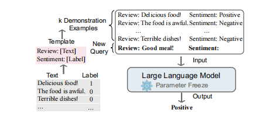

# [ in context learning ](https://arxiv.org/pdf/2301.00234.pdf)

## 关键思想:

 [in context learning的关键思想是从类比中学习,期望模型学习隐藏在演示中的模式，并据此做出正确的预测。

## 定义

Incontext learning is a paradigm that allows language models to learn tasks given only a few examples In-context Learning in the form of demonstration. Essentially, it estimates the likelihood of the potential answer conditioned on the demonstration by using a well-trained language model.

上下文学习是一种允许语言模型学习任务的范例，只给出了少数以演示形式的上下文学习。本质上，它通过使用一个训练良好的语言模型来估计基于演示条件的潜在答案的可能性。(与需要使用反向梯度更新模型参数的训练阶段的监督学习不同，**ICL 不需要参数更新，并直接对预先训练好的语言模型进行预测（这是与 prompt，传统 demonstration learning 不同的地方，ICL 不需要在下游 P-tuning 或 Fine-tuning）**。我们希望该模型学习隐藏在演示中的模式，并据此做出正确的预测)

## 总体介绍架构

## ICL与其他相关概念之间的区别

* 提示学习：提示可以是离散的模板或软参数，以鼓励模型来预测所需的输出。严格地说，ICL可以看作是提示调优的一个子类，其中演示是提示的一部分。

* few-shot: ew-shot learning 是一种通用的机器学习方法，它使用参数自适应，在有限数量的监督例子下学习任务的最佳模型参数。相比之下，ICL不需要参数更新，并且直接在预先训练过的llm上执行.

## warp up in ICL

预热是ICL的一个可选过程，它在ICL推理之前调整llm，包括修改llm的参数或添加其他参数。与微调不同，热身的目的不是针对LLM训练LLM，而是提高模型的整体ICL能力。主要目的:监督训练和自监督训练都提出在ICL推理之前对llm进行训练。其关键思想是通过引入接近上下文学习的目标来弥合训练前和下游ICL格式之间的差距。

* 有监督的上下文training : 做一个具体任务的适应

* 自监督ICT training :在下游任务中构建与ICL格式对齐的自监督训练数据.

## Demonstration Selection (样例选择)

#### 无监督的样例选择方法:

* 选择最近的邻居

* 距离度量是基于句子嵌入的预定义的L2距离或余弦相似度距离。

* 互信息也是一个有价值的选择度量

* 试图选择困惑度较低的提示

* 模型的输出分数作为选择标准

### 自监督的样例选择方法: 最大的目标就是对齐尽可能的让样例的语义与要测试的句子语义一致

* 监督的检索器（例如，BM25）来回忆作为候选者的类似的例子，然后构建一个有监督的检索器EPR来从候选者中选择演示。

* 评分的LM用于评估每个候选示例和输入的连接的分数

#### 样例的顺序问题

* 根据它们到输入的距离对例子进行了适当的排序，所以最右边的演示是最接近的例子。

* 他们发根据它们到输入的距离对例子进行了适当的排序，所以最右边的演示是最接近的例子。现熵度量和ICL性能之间存在正相关关系。他们直接使用熵度量来选择例子的最佳排序。

#### 推理步骤格式化 Reasoning Steps Formatting

在输入和输出之间添加中间推理步骤来构建演示，称为思想链（CoT）。使用CoT，llm可以预测推理步骤和最终答案。CoT提示可以通过将输入-输出映射分解为许多中间步骤来学习复杂的推理。

## ICL的几个结论:

* ## **结论1：ICL中Ground Truth信息无关紧要**

* ## **结论2：ICL的性能收益主要来自独立规范的输入空间和标签空间，以及正确一致的演示格式**
