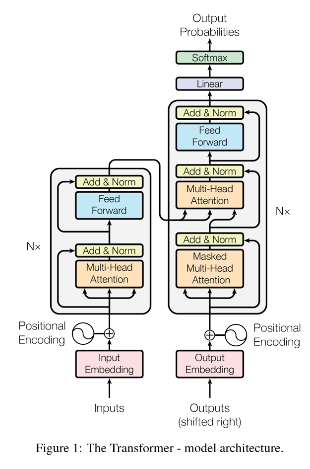
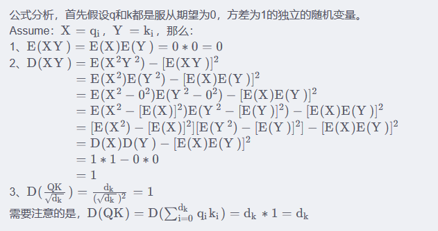

# seq2seq模型基础模块

## 1. cnn

### 1.权重共享

        平移不变性

        可并行计算

     2.滑动窗口

        基本假设: 局部关联性

            以来多层堆积来进行长程建模

     3.相对位置敏感,对绝对位置不敏感

## 2. rnn 依次有序递归建模

        对顺序敏感

        穿行计算耗时

        长程建模能力弱

        计算复杂度与序列长度呈线性关系

        单步计算复杂度不变

        对相对位置敏感,对绝对也位置敏感

## 3. [transformer](./Code/transformer_core_implement.ipynb)

        无局部假设:可以针对全局进行建模

            可并行运算

            相对位置不敏感

        无有序假设

            需要位置编码来反映位置变化对特征的影响 : 原因:序列建模任务中的顺序关系

            对绝对位置不敏感

        任意两个字符均可建模

            擅长长短程建模

            自注意力机制需要序列长度的平方级别复杂度

## [ transformer]([The Annotated Transformer (harvard.edu)](http://nlp.seas.harvard.edu/2018/04/03/attention.html))

```
transformer

    encoder
            input word embedding 
                由稀疏的one-hot进入一个不带表示的FFN得到一个稠密的连续向量

            position encoding 
                通过sin/cos来固定表征
                    每个位置的encoding事确定的
                    对于不同的句子,相对位置的距离一致
                    可以推广到更长的测试句子
                PE(pos+k)可以写成PE(k)的线性组合
                通过残差链接来使得位置信息流入深层

            multi-head self attention 
                使得建模能力更强, 表征空间更丰富
                由多组QKV构成,每组单独计算一个attention向量
                把每组的attention向量拼起来,并进入过一个 FFN得到最终的向量

            feed-forward network 
                只考虑单独位置进行建模
                不同位置参数共享
                类似于1*1pointwise convolution

    decoder
            output word embedding
            masked multi-head self attetion 
            multi head cross attention 
            feed forward network 
            softmax

    使用类型
        Encoder only :bert,分类任务,非流式任务
        Decoder only :Gpt系列, 模型建模, 自回归生成任务, 流式任务
        Encoder-Decoder  机器翻译,语音识别

    特点
        无先验架设(例如:局部关联性,有序建模性)
        核心计算在于自注意力机制,平方复杂度
        数据的要求于先验假设的程度成反比
```



$$
attention(q,k,v) = softmax( \frac{q*k}{\sqrt{d_{model}}})v

$$

#### [除d_model的原因](https://zhuanlan.zhihu.com/p/436614439)

```
1. 首先要除以一个数，防止输入softmax的值过大，导致偏导数趋近于0；
2. 选择根号d_k是因为可以使得q*k的结果满足期望为0，方差为1的分布，类似于归一化
```



$$
D(cX) = c^2D(x)
$$

### 两个主要模块的作用

1. multi-head self attention : 字与字之间 位置的混合学习

2. FFN :一个特征的多个维度上的混合学习

### layerNorm():

```

```
