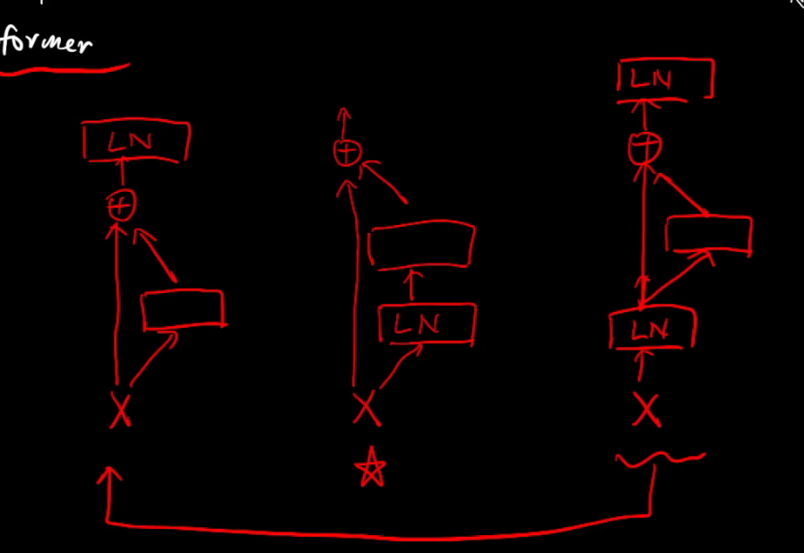
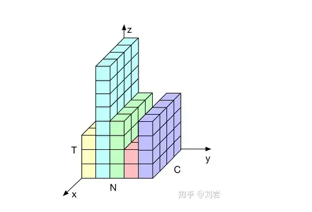

# seq2seq模型基础模块

## 1. cnn

### 1.权重共享

        平移不变性

        可并行计算

     2.滑动窗口

        基本假设: 局部关联性

            以来多层堆积来进行长程建模

     3.相对位置敏感,对绝对位置不敏感

## 2. rnn 依次有序递归建模

        对顺序敏感

        穿行计算耗时

        长程建模能力弱

        计算复杂度与序列长度呈线性关系

        单步计算复杂度不变

        对相对位置敏感,对绝对也位置敏感

## 3. [transformer](./Code/transformer_core_implement.ipynb)

        无局部假设:可以针对全局进行建模

            可并行运算

            相对位置不敏感

        无有序假设

            需要位置编码来反映位置变化对特征的影响 : 原因:序列建模任务中的顺序关系

            对绝对位置不敏感

        任意两个字符均可建模

            擅长长短程建模

            自注意力机制需要序列长度的平方级别复杂度

## [ transformer]([The Annotated Transformer (harvard.edu)](http://nlp.seas.harvard.edu/2018/04/03/attention.html))

```
transformer

    encoder
            input word embedding 
                由稀疏的one-hot进入一个不带表示的FFN得到一个稠密的连续向量

            position encoding 
                通过sin/cos来固定表征
                    每个位置的encoding事确定的
                    对于不同的句子,相对位置的距离一致
                    可以推广到更长的测试句子
                PE(pos+k)可以写成PE(k)的线性组合
                通过残差链接来使得位置信息流入深层

            multi-head self attention 
                使得建模能力更强, 表征空间更丰富
                由多组QKV构成,每组单独计算一个attention向量
                把每组的attention向量拼起来,并进入过一个 FFN得到最终的向量

            feed-forward network 
                只考虑单独位置进行建模
                不同位置参数共享
                类似于1*1pointwise convolution

    decoder
            output word embedding
            masked multi-head self attetion 
            multi head cross attention 
            feed forward network 
            softmax

    使用类型
        Encoder only :bert,分类任务,非流式任务
        Decoder only :Gpt系列, 模型建模, 自回归生成任务, 流式任务
        Encoder-Decoder  机器翻译,语音识别

    特点
        无先验架设(例如:局部关联性,有序建模性)
        核心计算在于自注意力机制,平方复杂度
        数据的要求于先验假设的程度成反比
```


$$
attention(q,k,v) = softmax( \frac{q*k}{\sqrt{d_{model}}})v

$$

#### [除d_model的原因](https://zhuanlan.zhihu.com/p/436614439)

```
1. 首先要除以一个数，防止输入softmax的值过大，导致偏导数趋近于0；
2. 选择根号d_k是因为可以使得q*k的结果满足期望为0，方差为1的分布，类似于归一化
```


$$
D(cX) = c^2D(x)
$$

### 两个主要模块的作用

1. multi-head self attention : 字与字之间 位置的混合学习

2. FFN :一个特征的多个维度上的混合学习

## 引入 Normalization

由于 covariate shift 问题的存在，x 的分布可能相差很大。要解决独立同分布的问题，“理论正确” 的方法就是对每一层的数据都进行***白化操作***。然而标准的白化操作代价高昂，且不可微不利于反向传播更新梯度。  
因此，以 BN 为代表的 Normalization 方法退而求其次，进行了简化的白化操作。  
基本思想是：在将 x 送给神经元之前，先对其做平移和伸缩变换， 将 x 的分布规范化成在固定区间范围的标准分布。

#### 目的:

为了保证模型的表达能力不因为规范化而下降。  
第一步的规范化会将几乎所有数据映射到激活函数的非饱和区（线性区），仅利用到了线性变化能力，从而降低了神经网络的表达能力。而进行再变换，则可以将数据从线性区变换到非线性区，恢复模型的表达能力。

### layerNorm():

post_norm                       pre_norm                                   ==post_norm



```python
# features: (bsz, max_len, hidden_dim)
# 
class LayerNorm(nn.Module):
    def __init__(self, features, eps=1e-6):
    super(LayerNorm, self).__init__()
    self.a_2 = nn.Parameter(torch.ones(features))
    self.b_2 = nn.Parameter(torch.zeros(features))
    self.eps = eps

    def forward(self, x):
    # 就是在统计每个样本所有维度的值，求均值和方差，所以就是在hidden dim上操作
    # 相当于变成[bsz*max_len, hidden_dim], 然后再转回来, 保持是三维
    mean = x.mean(-1, keepdim=True) # mean: [bsz, max_len, 1]
    std = x.std(-1, keepdim=True) # std: [bsz, max_len, 1]
        # 注意这里也在最后一个维度发生了广播
    return self.a_2 * (x - mean) / (std + self.eps) + self.b_2
```



### Batch Norm

BN在batch维度的归一化，也就是对于每个batch，该层相应的output位置归一化所使用的mean和variance都是一样的。

BN的学习参数包含rescale和shift两个参数。  

1. BN在单独的层级之间使用比较方便，比如CNN。得像RNN这样层数不定，直接用BN不太方便，需要对每一层（每个time step）做BN，并保留每一层的mean和variance。不过由于RNN输入不定长（time step长度不定），可能会有validation或test的time step比train set里面的任何数据都长，因此会造成mean和variance不存在的情况。  

2. BN会引入噪声（因为是mini batch而不是整个training set），所以对于噪声敏感的方法（如RL）不太适用。

### Layer Norm

$$
\text { LayerNorm }(x)=\alpha \odot \frac{x-\mu}{\sqrt{\sigma^{2}+\epsilon}}+\beta
$$

LayerNorm实际就是对隐含层做层归一化，即对某一层的所有神经元的输入进行归一化。（每hidden_size个数求平均/方差）  

1. 它在training和inference时没有区别，只需要对当前隐藏层计算mean and variance就行。不需要保存每层的moving average mean and variance。  

2. 不受batch size的限制，可以通过online learning的方式一条一条的输入训练数据。  

3. LN可以方便的在RNN中使用。  

4. LN增加了gain和bias作为学习的参数。
