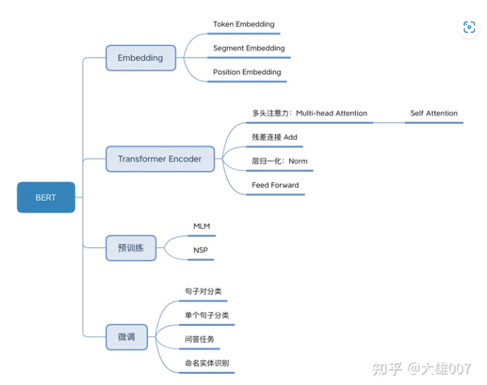
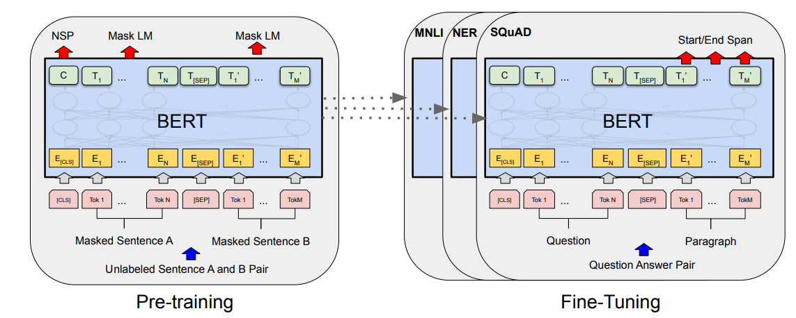
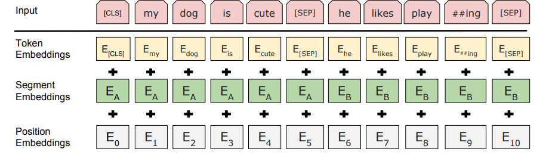

# 01 BERT(Bidirectional Encoder Representation from Transformers)

### 参数量

ERTBASE (L=12, H=768, A=12, Total Parameters=110M) and BERTLARGE (L=24, H=1024, A=16, Total Parameters=340M).

### [知识来源参考]([读懂BERT，看这一篇就够了 - 知乎 (zhihu.com)](https://zhuanlan.zhihu.com/p/403495863))

## 整体框架

### Embedding

1. Token embeddings 随机初始化,(文中使用的d=768)

2. Segment embeddings 用来表示两个不同的句子 [000111]   (lookup 表 2*768)

3. position embeddings 用来建模token之间的相对位置
   
   BERT 在各个位置上学习一个向量来表示序列顺序的信息编码进来，这意味着 Position Embeddings 实际上是一个 (512, 768) 的 lookup 表
   
   正余弦的表示方法的主要优势在于可以处理更长的 Sequence

    4. CLS 的作用 : 与文本中已有的其它词相比，这个无明显语义信息的符号会更“公平”地融合文本中各个词的语义信息，从而更好的表示整句话的语义

## bert的预训练

BERT是一个多任务模型，它的预训练（Pre-training）任务是由两个自监督任务组成，即MLM和NSP，如图所示。

### MLM

MLM是指在训练的时候随即从输入语料上mask掉一些单词，然后通过的上下文预测该单词，该任务非常像我们在中学时期经常做的完形填空。正如传统的语言模型算法和RNN匹配那样，MLM的这个性质和Transformer的结构是非常匹配的。

在BERT的实验中，15%的WordPiece Token会被随机Mask掉。在训练模型时，一个句子会被多次喂到模型中用于参数学习，但是Google并没有在每次都mask掉这些单词，而是在确定要Mask掉的单词之后，做以下处理。  

+ 80%的时候会直接替换为[Mask]，将句子 "my dog is cute" 转换为句子 "my dog is [Mask]"。  

+ 10%的时候将其替换为其它任意单词，将单词 "cute" 替换成另一个随机词，例如 "apple"。将句子 "my dog is cute" 转换为句子 "my dog is apple"。

+ 10%的时候会保留原始Token，例如保持句子为 "my dog is cute" 不变。

这样做的原因:  

1. 如果句子中的某个Token 100%都会被mask掉，那么在fine-tuning的时候模型就会有一些没有见过的单词\

2. 加入随机Token的原因是因为Transformer要保持对每个输入token的分布式表征，否则模型就会记住这个[mask]是token ’cute‘.

3. 至于单词带来的负面影响，因为一个单词被随机替换掉的概率只有15%*10% =1.5%，这个负面影响其实是可以忽略不计的。 另外文章指出每次只预测15%的单词，因此模型收敛的比较慢

#### 优点:

1. 被随机选择15%的词当中以10%的概率用任意词替换去预测正确的词，相当于文本纠错任务，为BERT模型赋予了一定的文本纠错能力

2. 被随机选择15%的词当中以10%的概率保持不变，缓解了finetune时候与预训练时候输入不匹配的问题（预训练时候输入句子当中有mask，而finetune时候输入是完整无缺的句子，即为输入不匹配问题）。

#### 缺点:

1. 针对有两个及两个以上连续字组成的词，随机mask字割裂了连续字之间的相关性，使模型不太容易学习到词的语义信息

### NSP:Next Sentence Prediction（NSP）的任务是判断句子B是否是句子A的下文。

##### **BERT,GPT,ELMO的区别**

### BERT 比 ELMo 效果好的原因

从网络结构以及最后的实验效果来看，BERT 比 ELMo 效果好主要集中在以下几点原因：

1. LSTM 抽取特征的能力远弱于 Transformer
2. 拼接方式双向融合的特征融合能力偏弱
3. BERT 的训练数据以及模型参数均多于 ELMo

## **BERT的优缺点**

### **优点**

+ BERT 相较于原来的 RNN、LSTM 可以做到并发执行，同时提取词在句子中的关系特征，并且能在多个不同层次提取关系特征，进而更全面反映句子语义。
+ 相较于 word2vec，其又能根据句子上下文获取词义，从而避免歧义出现。

### **缺点**

+ 模型参数太多，而且模型太大，少量数据训练时，容易过拟合。
+ BERT的NSP任务效果不明显，MLM存在和下游任务mismathch的情况。
+ BERT对生成式任务和长序列建模支持不好。

## ref from :[读懂BERT，看这一篇就够了 - 知乎 (zhihu.com)](https://zhuanlan.zhihu.com/p/403495863)

- [x] 

---

# 02 Roberta: A Robustly Optimized BERT Pretraining Approach

### roberta 的主要贡献不在模型的创新,而是提出一种效果更好的预训练模型训练方式,模型的结构和bert一致

#### 2.1 更多的数据

RoBERTa 采用了 160G 的训练文本，而 BERT 仅使用 16G 的训练文本

#### 2.2 更大批次（Large Batch)

批量（batch），常规设置128，256等等便可，如 BERT则是256，RoBERTa 在训练过程中使用了更大的批数量。研究人员尝试过从 256 到 8000 不等的批数量

#### 2.3 更多训练（More Steps）

#### 2.4 Adam优化

#### 2.5 No NSP and Input Format

> Next Sentence Prediction (NSP) 数据生成方式和任务改进：取消下一个句子预测，并且数据连续从一个文档中获得 

总体来说:使用连续 的长句子,来作为模型的输入 且并不适用 NSP LOSS的效果最好

总的可以观察到:

+ 真实句子过短，不如拼接成句子段的效果
+ 无NSP任务，略好过有NSP
+ 不跨文档好过跨文档

#### 2.6 Text encoding

Byte-Pair Encoding（BPE）是字符级和词级别表征的混合;  原版的 BERT 实现使用字符级别的 BPE 词汇，大小为30K，是在利用启发式分词规则对输入进行预处理之后学得的。

roberta使用unicode的bytes进行编码，用于学习高频字节的组合，添加到原有词表中.

#### 2.7 Masking

> ### 全词Masking(Whole Word Masking)(wwm)
> 
> 1. 原有基于WordPiece的分词方式会把一个完整的词切分成若干个子词，在生成训练样本时，这些被分开的子词会随机被mask。 在`全词Mask`中，如果一个完整的词的部分WordPiece子词被mask，则同属该词的其他部分也会被mask，即`全词Mask`。

> ### 动态 Mask(dynamic masking)
> 
> 1. BERT 依赖随机掩码和预测 token。原版的 BERT 实现在数据预处理期间执行一次掩码，得到一个静态掩码。而 RoBERTa 使用了动态掩码：每次向模型输入一个序列时都会生成新的掩码模式。这样，在大量数据不断输入的过程中，模型会逐渐适应不同的掩码策略，学习不同的语言表征。

## 总结 reberta是bert的继承 ,主要改动在于训练方法的调整

1. 数据生成方式和任务改进：取消下一个句子预测，并且数据连续从一个文档中获得。
2. 更大更多样性的数据：使用 30G 中文训练，包含 3 亿个句子，100 亿个字 (即 token）。由于新闻、社区讨论、多个百科，保罗万象，覆盖数十万个主题，共160+G数据。
3. Byte-Pair Encoding（BPE）是字符级和词级别表征的混合。
4. 训练更久：超过500k steps
5. 更大批次：使用了超大（8k）的批次 batch size。
6. 调整优化器的参数。
7. 使用全词 mask（whole word mask）和动态的mask。

--- 03 BART: Denoising Sequence-to-Sequence Pre-training for Natural Language Generation, Translation, and Comprehension

# 03 BART: Denoising Sequence-to-Sequence Pre-training for Natural Language Generation, Translation, and Comprehension

### motivation :由于基于BERT类的生成模型大多在预训练和下游任务之间存在一定的差异，导致生成模型的结果并不理想，本文提出了BART模型，更加充分去利用上下文信息和自回归特点。

### 3.1 与其他主流模型的区别

1. **GPT**是一种Auto-Regressive(自回归)的语言模型。它也可以看作是Transformer model的Decoder部分，它的优化目标就是标准的语言模型目标：序列中所有token的联合概率。

2. **BERT**是一种Auto-Encoding(自编码)的语言模型。它也可以看作是Transformer model的Encoder部分，在输入端随机使用一种特殊的[MASK]token来替换序列中的token，这也可以看作是一种noise，所以BERT也叫Masked Language Model。

### 3.2 主要贡献:

BART提出了一个结合双向和自回归的预训练模型。**BART**吸收了BERT的bidirectional encoder和GPT的left-to-right decoder各自的特点，建立在**标准的seq2seq Transformer model**的基础之上，这使得它比BERT更适合文本生成的场景；相比GPT，也多了双向上下文语境信息.

### 3.3 模型架构

**BART使用了标准的seq2seq tranformer结构**。

BART-base使用了6层的encoder和decoder, BART-large使用了12层的encoder和decoder。

BART的模型结构与BERT类似，不同点在于: 

1. decoder部分基于encoder的输出节点在每一层增加了cross-attention（类似于tranformer的seq2seq模型）；

2. BERT的词预测之前使用了前馈网络，而BART没有。总的来讲，在同等规模下，BART比BERT多了10%的参数。

### 3.4 bart的预训练

**BART的预训练是在于破坏原文档然后优化重构loss**，通过交叉熵来计算decoder输出与原文档的差异。极端情况下，当原文档信息全部丢失时，BART相当于语言模型。

BART采用了多种方式破坏原文档，即采用了多种Noise.

+ **Token Masking** 随机替换原始token为[MASK]
+ **Token Deletion** 随机删除输入的token。相比较于Token Masking，模型必须决定哪个位置是遗漏的。
+ **Text Infilling** Text infilling是基于spanBERT的思路，取连续的token用[MASK]替换，span的长度服从  的泊松分布。特殊情况下，当span长度为0时，相当于插入了一个mask。
+ **Sentence Permutation** 打乱文档中句子的顺序。
+ **Document Rotation** 随机选择一个token,然后旋转文本使得新的文本以这个token开头。此任务的目的用于判别文本的开头。

### 3.5 bart的fine-tune任务

### 3.5.1Sequence Classification Tasks

对于序列分类（文本分类）任务，encoder和decoder部分都用相同的输入，将deocoder最后一个节点用于多类别线性分类器中。此方法与BERT的CLS token较为类似；区别在于,BART在decoder部分最后增加了一个token，如此，便可获得来自完整输入的解码信息。

#### 3.5.2  Token Classification Tasks

对于序列标注任务，同样是在decoder和encoder采用相同的文本输入，以decoder的隐藏节点输出用于预测每个节点的类别。

#### 3.5.3 Sequence Generation Tasks

由于BART的模型框架本身就采用了自回归方式，因而在finetune序列生成任务时，可直接在encoder部分输入原始文本，decoder部分用于预测待生成的文本。

#### 3.5.4  Machine Translation

因输入语言不再是预训练模型采用的英语, 本文替换encoder的embedding layer的参数为随机初始化所得。然后，整个finetue阶段便可分为两步：

1. 先冻结BART的大部分参数，仅仅更新encoder部分的randomly initialized encoder和BART positional embeddings，以及输入到BART的第一层self-attention映射矩阵。

2. 更新BART的全部参数，这一步，仅需迭代几次即可。

## 总结:

最大的贡献就是多种reconstruction loss的构造.

# 04 T5: Exploring the Limits of Transfer Learning with a Unified Text-to-Text Transformer

T5 的基本思想是将每个 NLP 问题都视为“text-to-text”问题，即将文本作为输入并生成新的文本作为输出，这允许将相同的模型、目标、训练步骤和解码过程，直接应用于每个任务。

idea 创新也不大，它最重要作用是给**整个 NLP 预训练模型领域提供了一个通用框架**，把所有任务都转化成一种形式

### 数据:

作者从 Common Crawl（一个公开的网页存档数据集，每个月大概抓取 20TB 文本数据） 里清出了 750 GB 的训练数据，然后取名为 ” Colossal Clean Crawled Corpus （超大型干净爬取数据）“，简称 C4。

### T5 架构

T5模型采用Transformer的encoder-decoder结构.

T5模型和原始的Transformer结构基本一致，除了做了如下几点改动：

+ remove the Layer Norm bias
+ place the Layer Normalization outside the residual path
+ use a different position embedding

#### 输入输出格式

在下游任务上**fine-tune**模型时，为了告诉模型当前要做何种任务，我们会给每条输入样本加一个与具体任务相关的前缀。

+ 翻译前缀translate English to German:
+ 分类前缀cola sentence:
+ 摘要前缀summarize:

注意这里每个任务前缀的选择可以认为是一种超参，即人为设计前缀样式。作者发现不同的前缀对模型的影响有限.

### T5文中中研究的模型架构

1. **Encoder-Decoder 型**，即 Seq2Seq 常用模型，分成 Encoder 和 Decoder 两部分，对于 Encoder 部分，输入可以看到全体，之后结果输给 Decoder，而 Decoder 因为输出方式只能看到之前的。此架构代表是 MASS（今年WMT的胜者），而 BERT 可以看作是其中 Encoder 部分。

2. 相当于上面的 **Decoder 部分**，当前时间步只能看到之前时间步信息。典型代表是 GPT2 还有最近 CTRL 这样的。

3. **Prefix LM（Language Model） 型**，可看作是上面 Encoder 和 Decoder 的融合体，一部分如 Encoder 一样能看到全体信息，一部分如 Decoder 一样只能看到过去信息。最近开源的 UniLM 便是此结构。

上面这些模型架构都是 Transformer 构成，之所以有这些变换，主要是**对其中注意力机制的 Mask 操作**。

通过实验发现，在提出的这个 Text-to-Text 架构中，Encoder-Decoder 模型效果最好. 因此**所谓的 T5 模型其实就是个 Transformer 的 Encoder-Decoder 模型**。

### 预训练目标的大范围探索

#### **1. 高层次方法（自监督的预训练方法）对比**

1. **语言模型式**，就是 GPT-2 那种方式，从左到右预测；
2. **BERT-style 式**，就是像 BERT 一样将一部分给破坏掉，然后还原出来；
3. Deshuffling （顺序还原）式，就是将文本打乱，然后还原出来。

Bert-style 最好

#### 2. **破坏时的策略**

1. **Mask 法**，如现在大多模型的做法，将被破坏 token 换成特殊符如 [M]；
2. **replace span（小段替换）法**，可以把它当作是把上面 Mask 法中相邻 [M] 都合成了一个特殊符，每一小段替换一个特殊符，提高计算效率；
3. **Drop 法**，没有替换操作，直接随机丢弃一些字符。

**Replace Span 法** 最好, 感觉约等于 bart

#### 3. **对文本百分之多少进行破坏**

BERT 的 **15%** 最好

因为 Replace Span 需要决定**对大概多长的小段进行破坏**  3 最好

## T5 训练方法总结

+ Transformer Encoder-Decoder 模型；
+ BERT-style 式的破坏方法；
+ Replace Span 的破坏策略；
+ 15 %的破坏比；
+ 3 的破坏时小段长度。

# Bart && T5的区别

### **预训练任务**

BART的预训练任务是**将带噪声的输入还原**。输入为ABCDE，在AB中插入一个span长度为0的mask，再将CD替换为mask，最终得到加噪输入的A_B_E。模型的目标是将其还原为ABCDE

T5使用两种任务，分为无监督和有监督。其中无监督任务也是Span级别的mask，不过输出**不需要还原整句**，只需要输出mask掉的tokens就可以，总共mask15%字符。有监督任务提升不大，这里不展开说明

### 微调

BART的微调方式如下图：

+ 左边是分类任务的微调方式，输入将会同时送入Encoder和Decoder，最终使用最后一个输出为文本表示。
+ 右边是翻译任务的微调方式，由于翻译任务的词表可能和模型词表不同，所以这里使用一个新的小型Encoder替换BART中的Embedding。

T5的微调方式如下图：无论是分类任务，还是生成任务，全都视为生成式任务。

### 位置编码

Transformers使用Position Encoding，使用sinusoidal函数

BERT和BART都换成了可学习的绝对位置嵌入

T5改成了相对位置嵌入(relative position embeddings)

<u>T5的输入不限制长度，因为使用了relative position embedding，BART采用了BERT类似的长度限制</u>

### 激活函数

Transformer最开始使用ReLU，BERT和GPT都使用GELU，BART也同样采用GELU，不过T5还是使用了最初的ReLU。

### 模型大小

BART-base：6encoder, 6decoder, 768hidden

BART-large：12encoder, 12decoder, 1024hidden

T5-base：12encoder, 12decoder, 768 hidden, 220M parameters（2x bert-base）

T5-large: 24encoder, 24decoder, 1024hidden, 770M parameters

T5-large的模型大小是BART-large的两倍。

# GPT
