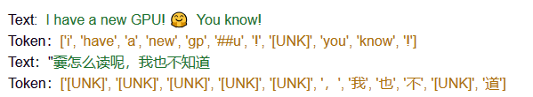
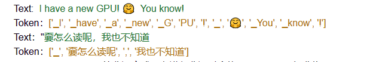

# Tokenzier

tokenize的目标是把输入的文本流，切分成一个个子串，每个子串相对有完整的语义，便于学习embedding表达和后续模型的使用。

### tokenize有三种粒度：**word/subword/char**

1. **word:** 是最自然的语言单元。对于英文等自然语言来说，存在着天然的分隔符，比如说空格，或者是一些标点符号，对词的切分相对容易。但是 如果基于词来做词汇表，由于长尾现象的存在，这个词汇表可能会超大。常规的词汇表，一般大小不超过5万。

2. **char/字符,** 也就是说，我们的词汇表里只有最基本的字符。而一般来讲，字符的数量是少量有限的。这样做的问题是，由于字符数量太小，我们在为每个字符学习嵌入向量的时候，每个向量就容纳了太多的语义在内，学习起来非常困难。

3. **subword子词级**，它介于字符和单词之间。比如说Transformers可能会被分成Transform和ers两个部分。**这个方案平衡了词汇量和语义独立性，是相对较优的方案**。它的处理原则是，**常用词应该保持原状，生僻词应该拆分成子词以共享token压缩空间**。

### 常用tokenize算法

最常用的三种tokenize算法：BPE（Byte-Pair Encoding），WordPiece和SentencePiece

1. ## Byte-Pair Encoding (BPE) /Byte-level BPE
   
   #### Byte-Pair Encoding
   
    * 首先，它依赖于一种预分词器pretokenizer来完成初步的切分。pretokenizer可以是简单基于空格的，也可以是基于规则的；
    + 分词之后，统计每个词出现的频次供后续计算使用。例如，我们统计到了5个词的词频
      
                   ("hug", 10), ("pug", 5), ("pun", 12), ("bun", 4), ("hugs", 5)
   
    + 建立基础词汇表，包括所有的字符，即：
      
      ```
                 ["b", "g", "h", "n", "p", "s", "u"]
      ```
    * 根据规则，我们分别考察2-gram，3-gram的基本字符组合，把高频的ngram组合依次加入到词汇表当中，直到词汇表达到预定大小停止。比如，我们计算出ug/un/hug三种组合出现频次分别为20，16和15，加入到词汇表中。
    + 最终词汇表的大小 = 基础字符词汇表大小 + 合并串的数量，比如像GPT，它的词汇表大小 40478 = 478(基础字符) + 40000（merges）。添加完后，我们词汇表变成：
   
    + ```
               ["b", "g", "h", "n", "p", "s", "u", "ug", "un", "hug"]
      ```
   
    + 实际使用中，如果遇到未知字符用<unk>代表。
   
   #### Byte-level BPE
   
               BPE的一个问题是，如果遇到了unicode，基本字符集可能会很大。一种处理方法是我们以一个字节为一种“字符”，不管实际字符集用了几个字节来表示一个字符。这样的话，基础字符集的大小就锁定在了256。
   
               例如，像GPT-2的词汇表大小为50257 = 256 + <EOS> + 50000 mergers，<EOS>是句子结尾的特殊标记。

2. ## WordPiece : 如果AB合起来是一个单词,如果 AB一起出来的概率除以 A和 B单独出现的概率这个值很大,我们就把AB作为一个完整的字符添加的字符表中
   
   WordPiece，从名字好理解，它是一种子词粒度的tokenize算法subword tokenization algorithm，很多著名的Transformers模型，比如BERT/DistilBERT/Electra都使用了它。
   
   它的原理非常接近BPE，不同之处在于，它在做合并的时候，并不是每次找最高频的组合，而是找能够**最大化训练集数据似然**的merge，即它每次合并的两个字符串A和B，应该具有最大的$\frac{P(AB)}{P(A)P(B)} $值。合并AB之后，所有原来切成A+B两个tokens的就只保留AB一个token，整个训练集上最大似然变化量与 $\frac{P(AB)}{P(A)P(B)}$成正比。
   
   #### BertTokenizer/WordPiece example
   
   ```
   from transformers import XLNetTokenizer
   tokenizer = XLNetTokenizer.from_pretrained("xlnet-base-cased")
   ```
   
   
   
   
   
                                    

3. ## Unigram
   
   与WordPiece一样，Unigram Language Model(ULM)同样使用语言模型来挑选子词。不同之处在于，BPE和WordPiece算法的词表大小都是从小到大变化，属于增量法。而Unigram Language Model则是减量法,即先初始化一个大词表，根据评估准则不断丢弃词表，直到满足限定条件。ULM算法考虑了句子的不同分词可能，因而能够输出带概率的多个子词分段。
   
   
   
   
   对于句子S ，$\vec{x}  = （x_1,x_2,...,x_m)$ 为句子的一个分词结果，由m个子词组成。注意一个句子存在很多种分词结果
   
   所以，当前分词下句子S的似然值可以表示为：
   
   $$
   P(\vec{x})=\prod_{i=1}^{m} P\left(x_{i}\right)
   $$

对于句子S，挑选似然值最大的作为分词结果，则可以表示为


$$
x^{*}=\arg \max _{x \in U(x)} P(\vec{x})
$$

这里$U(x)$包含了句子的所有分词结果。在实际应用中，词表大小有上万个，直接罗列所有可能的分词组合不具有操作性。针对这个问题，可通过维特比算法得到来解决。

那怎么求解每个子词的概率$P(x_i)$呢？ULM通过EM算法来估计。假设当前词表V, 则M步最大化的对象是如下似然函数：

$$
L=\sum_{s=1}^{|D|} \log \left(P\left(X^{(s)}\right)\right)=\sum_{s=1}^{|D|} \log \left(\sum_{x \in U\left(X^{(s)}\right)} P(x)\right)
$$


其中，|D|是语料库中语料数量。上述公式的一个直观理解是，将语料库中所有句子的所有分词组合形成的概率相加。

但是，初始时，词表V并不存在。因而，ULM算法采用不断迭代的方法来构造词表以及求解分词概率：

1. 初始时，建立一个足够大的词表。一般，可用语料中的所有字符加上常见的子字符串初始化词表，也可以通过BPE算法初始化。
2. 针对当前词表，用EM算法求解每个子词在语料上的概率。
3. 对于每个子词，计算当该子词被从词表中移除时，总的loss降低了多少，记为该子词的loss。
4. 将子词按照loss大小进行排序，丢弃一定比例loss最小的子词(比如20%)，保留下来的子词生成新的词表。这里需要注意的是，单字符不能被丢弃，这是为了避免OOV情况。
5. 重复步骤2到4，直到词表大小减少到设定范围。

可以看出，ULM会保留那些以较高频率出现在很多句子的分词结果中的子词，因为这些子词如果被丢弃，其损失会很大。

## 4. SentencePiece

上述的所有算法都有一个前提：输入以空格来进行区分。然而并不是所有语言的词语都是使用空格来进行分割（比如中文、日文），一种比较常见的做法是使用预分词。

为了更加一般化的解决这个问题，谷歌推出了开源工具包SentencePiece 。SentencePiece是把一个句子看做一个整体，再拆成片段，而没有保留天然的词语的概念。一般地，它把space也当做一种特殊的字符来处理，再用BPE或者Unigram算法来构造词汇表。比如，XLNetTokenizer就采用了_来代替空格，解码的时候会再用空格替换回来.

SentencePiece还能支持字符和词级别的分词。

SentencePiece主要解决了以下三点问题：

1. 以unicode方式编码字符，将所有的输入（英文、中文等不同语言）都转化为unicode字符，解决了多语言编码方式不同的问题。
2. 将空格编码为‘_’， 如'New York' 会转化为['▁', 'New', '▁York']，这也是为了能够处理多语言问题，比如英文解码时有空格，而中文没有， 这种语言区别
3. 优化了速度，如果您实时处理输入并对原始输入执行标记化，则速度会太慢。 SentencePiece 通过使用 BPE 算法的优先级队列来加速它来解决这个问题，以便您可以将它用作端到端解决方案的一部分。

##### ## XLNetTokenizer/SentencePiece example

```
from transformers import XLNetTokenizer
tokenizer = XLNetTokenizer.from_pretrained("xlnet-base-cased")
```


