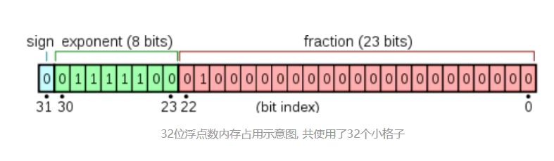
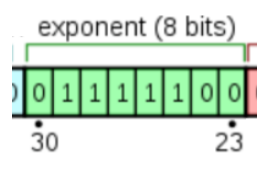
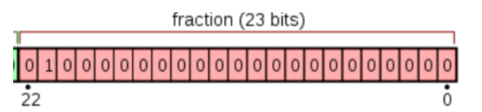
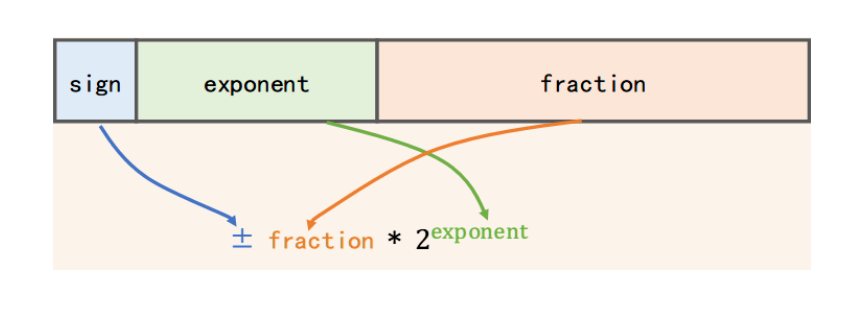
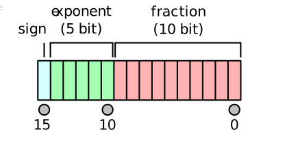
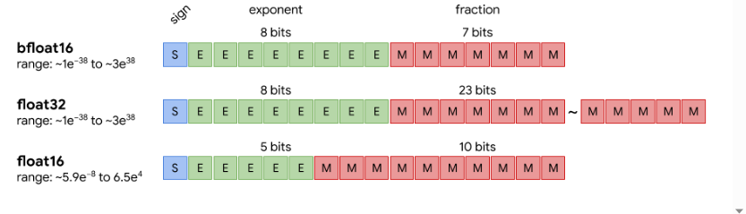

# 1. 基本数据类型

#### 32位操作系统

```python
短整型short

    2byte=16bit；

    -2^15~2^15-1

 整型int：

    所占内存大小：4byte=32bit；

    所能表示范围：-2147483648~2147483647；(即-2^31~2^31-1)

长整型long：

    所占内存大小：4byte=32bit；

    所能表示范围：-2147483648~2147483647；(即-2^31~2^31-1)

字符型char：

    所占内存大小：1byte=8bit；

布尔类型bool：
    所占内存大小：1byte=8bit；
    所能表示的范围：只能取两个值false或者true；所以最小值就是：0， 最大值：1.
 单精度float：    
    所占内存大小：4byte=32bit；
    所能表示的范围：(1.17549e-038)~(3.40282e+038);

双精度double：
   所占内存大小：8byte=64bit；
   所能表示的范围：(2.22507e-308)~(1.79769e+308);
```

### 64位操作系统

```
64位操作系统：long：8字节，int：4字节 
```

### IEEE754标准: 一 , 浮点数在内存中的存储方式

([IEEE754标准: 一 , 浮点数在内存中的存储方式 - 知乎 (zhihu.com)](https://zhuanlan.zhihu.com/p/343033661)



## 1. 符号位: sign

符号位: 占据最高位(第31位)这一位, 用于表示这个浮点数是正数还是负数, 为0表示正数, 为1表示负数.

## **2. 偏移后的指数位: biased exponent**



用于表示以2位底的指数.

 8位二进制可以表示256种状态, **IEEE754规定, 指数位用于表示[-127, 128]范围内的指数**.

不过为了表示起来更方便, 浮点型的指数位都有一个固定的**偏移量(bias)**, 用于使 **指数 + 这个偏移量 = 一个非负整数**. 这样指数位部分就不用为如何表示负数而担心了.

即, 如果你运算后得到的指数是 **-127**, 那么偏移后, 在指数位中就需要表示为: -127 + 127(偏移量) = **0**  (目的 解决浮点数对阶问题)

## **3. 尾数位:fraction**



尾数位: 占据剩余的22位到0位这23位. 用于存储尾数.


然后, 需要把这个二进制数转换为以2为底的指数形式:

二进制

$$
10100.1 = 1.01001* 2^4
$$

注意转换时, 对于乘号左边, 加粗的那个二进制数**1.01001**, 需要把小数点放在左起第一位和第二位之间. 且第一位需要是个非0数. 这样表示好之后, 其中<mark>的**1.01001**就是尾数</mark>.

用 二进制数 表示 十进制浮点数 时, 表示为**尾数*指数**的形式, 并把尾数的小数点放在第一位和第二位之间, 然后保证第一位数非0, 这个处理过程叫做**规范化(normalized)

再来看看规范化之后的这个数: 1.01001 * 2^4

其中1.01001是**尾数**, 而4就是**偏移前的指数(unbiased exponent)**, 上文讲过, 32位单精度浮点数的偏移量(bias)为127, 所以这里加上偏移量之后, 得到的**偏移后指数(biased exponent)**就是 4 + 127 = 131**, 131转换为二进制就是**1000 0011**

现在还需要对**尾数**做一些特殊处理

**1. 隐藏高位**

你会发现, 尾数部分的最高位始终为**1.** 比如这里的 1.01001, 这是因为前面说过, 规范化之后, 尾数中的小数点会位于左起第一位和第二位之间. 且第一位是个非0数. 而二进制中, 每一位可取值只有0或1, 如果第一位非0, 则第一位只能为1. 所以在存储尾数时, 可以省略前面的 1和小数点. 只记录尾数中小数点之后的部分, 这样就节约了一位内存. 所以这里只需记录剩余的尾数部分: 01001

**2.低位补0**

有时候尾数会不够填满尾数位(即图中的红色格子). 比如这里的, 尾数01001不够23位

此时, 需要在**低位补零**, 补齐23位.

原尾数是: 01001(不到23位)

补零之后是: 0100 1000 0000 0000 000 (补至23位)



### [Float Toy在线可视化float工具](https://evanw.github.io/float-toy/)

---

### 1. float 16



## bf16 brain float 16


