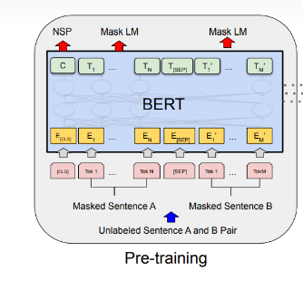
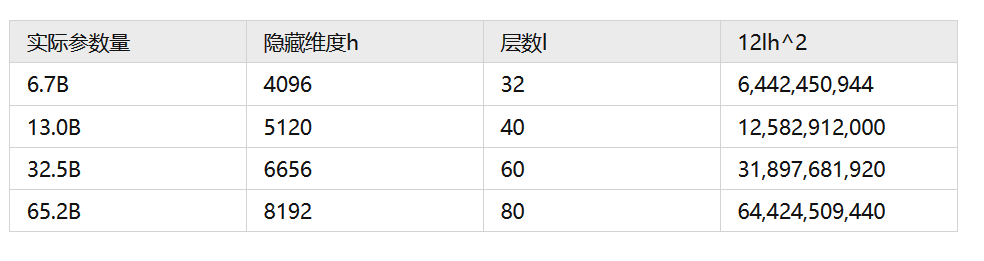
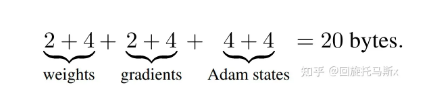
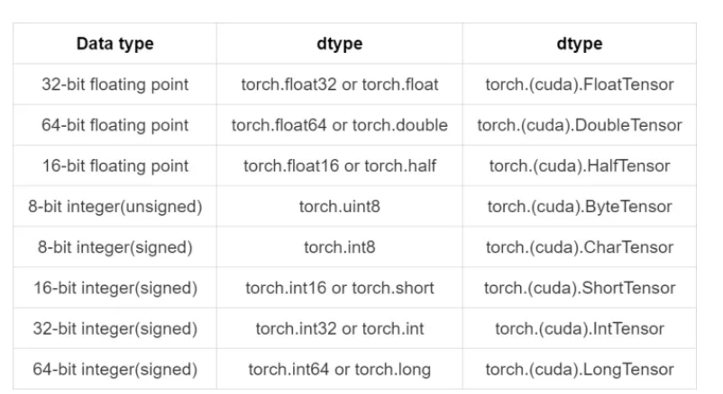

## 1. 计算模型参数量的来源（bert）

### [分析transformer模型的参数量、计算量、中间激活、KV cache - 知乎 (zhihu.com)](https://zhuanlan.zhihu.com/p/624740065)

### [(93条消息) Bert/Transformer模型的参数大小计算_transformer参数量_*Lisen的博客-CSDN博客](https://blog.csdn.net/weixin_43922901/article/details/102602557)



```
Bert(base) 参数个数计算:
    Embedding_layer:   
        token_embedding : |V|*d               30522*768
        position_embedding : max_len * d      512*768
        segment_embedding:  2* d              2 *768
        Layer_norm : 2*d                      2*768
    Encoder_layer: *12
        Q,K,V   : d*d*3                        3*768*768
        (如果存在bias) 3*d
        (如果需要attention_proj) :  d_att * d 约等于 d*d
        LayerNorm : 2*d                        2*768
        FFN:        8d*d                       8 *768*768
           W1: d*4d  
           W2: 4d*d 
           (如果计算bias)  :4d +d 
        LayerNorm : 2*d                        2*768

        


SUM = (|V| +max_len+2)*d + 2*d + 12[d*d*3 + d*d +  2*d + 8*d*d+2*d]
    =  31,036 *d + 1,536  + 84,971,520
    =  23,835,648 + 1,536  + 84,971,520
    = 108,808,704   约等于 108*10^6  110M
因此： bert-base 以4Bit的32位浮点数存储 需要 400M左右
```

### 2. 快速计算

transformer模型由  l  个相同的层组成，每个层分为两部分：self-attention块和MLP块。
self-attention块的模型参数有  Q 、 K 、 V  的权重矩阵  W_{Q} 、 W_{K} 、 W_{V}  和偏置，输出权重矩阵  W_{O}  和偏置，4个权重矩阵的形状为  [h, h] ， 4  个偏置的形状为  [h]  。self- attention块的参数量 为  4 h^{2}+4 h  。

MLP块由2个线性层组成，一般地，第一个线性层是先将维度从  h  映射到  4 h  ，第二个线性层再将 维度从  4 h  映射到  h  。第一个线性层的权重矩阵  W_{1}  的形状为  [h, 4 h]  ，偏置的形状为  [4 h]  。第二 个线性层权重矩阵  W_{2}  的形状为  [4 h, h]  ，偏置形状为  [h]  。MLP块的参数量为  8 h^{2}+5 h  。
self-attention块和MLP块各有一个layer normalization，包含了2个可训练模型参数：缩放参数  \gamma  和平移参数  \beta  ，形状都是  [h]  。2个layer normalization的参数量为  4 h  。

总的，**每个transformer层的参数量**为   $ 12h^2 +13h$。

此之外，词嵌入矩阵的参数量也较多，词向量维度通常等于隐藏层维度$h$  ，词嵌入矩阵的参数量为$|V|h$  。最后的输出层的权重矩阵通常与词嵌入矩阵是参数共享的。

关于位置编码，如果采用可训练式的位置编码，会有一些可训练模型参数，数量比较少。如果采用相对位置编码，例如RoPE和ALiBi，则不包含可训练的模型参数。我们忽略这部分参数。

综上，  **$l$层transformer模型的可训练模型参数量为** $l (12h^2+13h )+Vh$ 。当隐藏维度  较大时，可以忽略一次项，<mark>**模型参数量近似为</mark>**  $12lh^2$

不同版本LLaMA模型的参数量。



### 3. 训练过程中的显存占用分析

在训练神经网络的过程中，占用显存的大头主要分为四部分：

>  1.模型参数

> 2.前向计算过程中产生的中间激活、
> 
> 3.后向传递计算得到的梯度、
> 
> 4.优化器状态。

这里着重分析参数、梯度和优化器状态的显存占用，中间激活的显存占用后面会详细介绍。训练大模型时通常会采用AdamW优化器，并用混合精度训练来加速训练，基于这个前提分析显存占用。

在一次训练迭代中，每个可训练模型参数都会对应1个梯度，并对应2个优化器状态（Adam优化器梯度的一阶动量和二阶动量）。设模型参数量为$\Theta$  ，那么梯度的元素数量为$为\Theta$，AdamW优化器的元素数量为 $为2\Theta$ 。float16数据类型的元素占2个bytes，float32数据类型的元素占4个bytes。在混合精度训练中，会使用float16的模型参数进行前向传递和后向传递，计算得到float16的梯度；在优化器更新模型参数时，会使用float32的优化器状态、float32的梯度、float32的模型参数来更新模型参数。因此，对于每个可训练模型参数，占用了  。使用AdamW优化器和混合精度训练来训练参数.使用AdamW优化器和混合精度训练来训练参数量为 $\Theta$的大模型，**模型参数、梯度和优化器状态占用的显存大小为**$20 \Theta$  。计算如图：

> 模型初始参数 的bytes (float16) : 2 $\theta$ 
> 
> 要更新的的模型参数（float32): 4 $\theta$
> 
> 2个优化器状态（Adam优化器梯度的一阶动量和二阶动量) (float32): 8 $\theta$
> 
> 梯度信息 (float16) : 2$\theta$  (float32) : 4$\theta$




### **4. 推理过程中的显存占用分析**

在神经网络的推理阶段，没有优化器状态和梯度，也不需要保存中间激活。**少了梯度、优化器状态、中间激活，模型推理阶段占用的显存要远小于训练阶段**。模型推理阶段，占用显存的大头主要是模型参数，如果使用float16来进行推理，**推理阶段模型参数占用的显存大概是$2\Theta$**

---

## ## 5. 计算量FLOPs估计

FLOPs，floating point operations，表示浮点数运算次数，衡量了计算量的大小。  
如何计算矩阵乘法的FLOPs呢？  
对于 $ A \in R^{1 \times n}, B \in R^{n \times 1} $ ，计算 AB需要进行n次乘法运算和 n 次加法运算，共计2n 次浮点数运算，需要  的FLOPs。对于 $A \in R^{m \times n}, B \in R^{n \times p}$ ，计算 AB 需要的浮点数运算次数为  2mnp 。


## 补充. Tensor的数据类型

在PyTorch中，主要有10种类型的tensor，其中重点使用的为以下八种(还有BoolTensor和BFloat16Tensor)：



在具体使用时可以根据网络模型所需的精度和显存容量进行选取。

+ 一般情况而言，模型参数和训练数据都是采用<mark>默认的32位浮点型</mark>；16位半精度浮点是为在GPU上运行的模型所设计的，因为这样可以尽可能节省GPU的显存占用。  
  当然这样节省显存空间也会缩小所能表达数据的能力。因此自pytorch1.6自动混合精度(automatic mixed precision)被更新后，将半精度和单精度混合使用以达到减少显存、提升推理速度的方法就被大面积的推广开来。在这里不对自动混合精度(AMP)模块做过多介绍

```python
torch.FloatTensor
torch.DoubleTensor
torch.HalfTensor
torch.ByteTensor
torch.CharTensor
torch.ShortTensor
torch.IntTensor
torch.LongTensor
```
