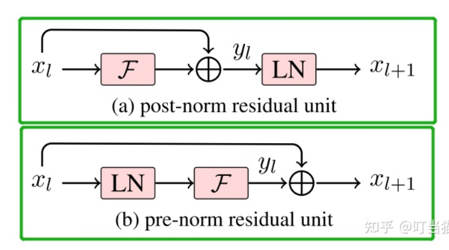
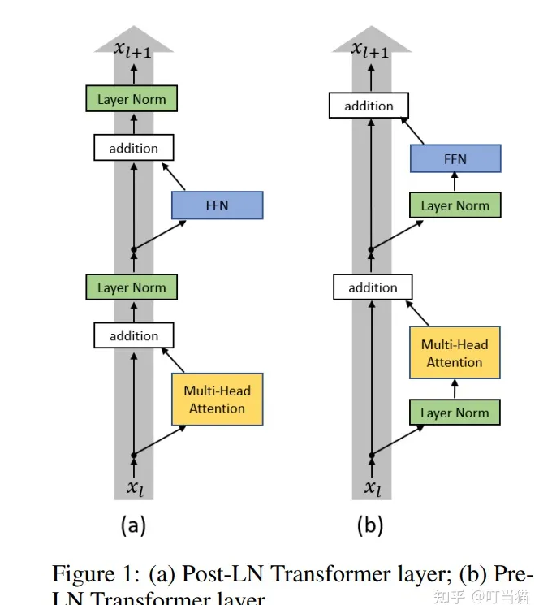

# 1 pre_norm  and post_norm

[pre_norm and post norm ref:](https://zhuanlan.zhihu.com/p/494661681)





同一设置之下，Pre Norm结构往往更容易训练，但最终效果通常不如Post Norm。Pre Norm更容易训练好理解，因为它的恒等路径更突出.

Pre Norm和Post Norm的式子分别如下：

$$
Pre Norm:  \quad \boldsymbol{x}_{t+1}=\boldsymbol{x}_{t}+F_{t}\left(\operatorname{Norm}\left(\boldsymbol{x}_{t}\right)\right) \\

Post Norm:  \quad \boldsymbol{x}_{t+1}=\operatorname{Norm}\left(\boldsymbol{x}_{t}+F_{t}\left(\boldsymbol{x}_{t}\right)\right) 
$$

在Transformer中，这里Norm的主要指Layer Normalization，但在一般的模型中，它也可以是Batch Normalization、Instance Normalization等，相关结论本质上是通用的。

显示Post Norm优于Pre Norm的工作有两篇，一篇是**[《Understanding the Difficulty of Training Transformers》](https://link.zhihu.com/?target=https%3A//arxiv.org/abs/2004.08249)**，一篇是**[《RealFormer: Transformer Likes Residual Attention》](https://link.zhihu.com/?target=https%3A//arxiv.org/abs/2012.11747)。

Post Norm的结构迁移性能更加好，也就是说在Pretraining中，Pre Norm和Post Norm都能做到大致相同的结果，但是Post Norm的Finetune效果明显更好。

#### 原因

pre Norm的深度有“水分”！也就是说，一个层的Pre Norm模型，其实际等效层数不如层的Post Norm模型，而层数少了导致效果变差了。

$$
\begin{aligned}
\boldsymbol{x}_{t+1} & =\boldsymbol{x}_{t}+F_{t}\left(\operatorname{Norm}\left(\boldsymbol{x}_{t}\right)\right) \\
& =\boldsymbol{x}_{t-1}+F_{t-1}\left(\operatorname{Norm}\left(\boldsymbol{x}_{t-1}\right)\right)+F_{t}\left(\operatorname{Norm}\left(\boldsymbol{x}_{t}\right)\right) \\
& =\cdots \\
& =\boldsymbol{x}_{0}+F_{0}\left(\left(\operatorname{Norm}\left(\boldsymbol{x}_{0}\right)\right)+\cdots+F_{t-1}\left(\operatorname{Norm}\left(\boldsymbol{x}_{t-1}\right)\right)+F_{t}\left(\operatorname{Norm}\left(\boldsymbol{x}_{t}\right)\right)\right.
\end{aligned}
$$

其中<mark>每一项都是同一量级</mark>的，那么有$x_{t+1} = \theta(x_{t})$，也就是说第t+1层跟第t层的差别就相当于t+1与t的差别(ep: 19 与18的差别)，当较大时，两者的相对差别是很小的，因此

$$
F_{t}({Norm}\left(\boldsymbol{x}_{t}\right))+F_{t+1}({Norm}\left(\boldsymbol{x}_{t+1}\right))\\
 \approx F_{t}({Norm}\left(\boldsymbol{x}_{t}\right))+F_{t}({Norm}\left(\boldsymbol{x}_{t}\right))\\
= (F_t\oplus F_t )(F_{t}({Norm}\left(\boldsymbol{x}_{t}\right))
$$

这个意思是说，当比t较大时，$x_t$与$x_{t+1}$相差较小，所以$F_{t}({Norm}\left(\boldsymbol{x}_{t}\right))$与$F_{t+1}({Norm}\left(\boldsymbol{x}_{t+1}\right))$很接近，因此原本一个t层的模型与t+1层的和，近似等效于一个更宽的层模型，所以在Pre Norm中多层叠加的结果更多是增加宽度而不是深度，层数越多，这个层就越“虚”。

说白了，Pre Norm结构无形地增加了模型的宽度而降低了模型的深度，而我们知道深度通常比宽度更重要，所以是无形之中的降低深度导致最终效果变差了。而Post Norm刚刚相反，在**[《浅谈Transformer的初始化、参数化与标准化》](https://link.zhihu.com/?target=https%3A//kexue.fm/archives/8620)**中我们就分析过，它每Norm一次就削弱一次恒等分支的权重，所以Post Norm反而是更突出残差分支的，因此Post Norm中的层数更加“足秤”，一旦训练好之后效果更优。

### transformer 中的实现:

1. 对主分支进行 dropout 

2. 再对post-norm

```python
class EncoderLayer(nn.Module):

    def __init__(self, d_model, ffn_hidden, n_head, drop_prob):
        super(EncoderLayer, self).__init__()
        self.attention = MultiHeadAttention(d_model=d_model, n_head=n_head)
        self.norm1 = LayerNorm(d_model=d_model)
        self.dropout1 = nn.Dropout(p=drop_prob)

        self.ffn = PositionwiseFeedForward(d_model=d_model, hidden=ffn_hidden, drop_prob=drop_prob)
        self.norm2 = LayerNorm(d_model=d_model)
        self.dropout2 = nn.Dropout(p=drop_prob)

    def forward(self, x, src_mask):
        # 1. compute self attention
        _x = x  ##残差保留
        x = self.attention(q=x, k=x, v=x, mask=src_mask)

        # 2. add and norm
        x = self.dropout1(x)
        x = self.norm1(x + _x)

        # 3. positionwise feed forward network
        _x = x   ##残差保留
        x = self.ffn(x)

        # 4. add and norm
        x = self.dropout2(x)
        x = self.norm2(x + _x)
        return x
```

# 2.

### 
