# 激活函数作用

core ref:

1. [深度学习笔记：如何理解激活函数？（附常用激活函数） - 知乎 (zhihu.com)](https://zhuanlan.zhihu.com/p/364620596)

2. [神经网络激活函数的作用是什么？ - 知乎 (zhihu.com)](https://zhuanlan.zhihu.com/p/143990814)

## 分析

**激活函数（Activation Function）是一种添加到人工神经网络中的函数，旨在帮助网络学习数据中的复杂模式。在神经元中，输入的input经过一系列加权求和后作用于另一个函数，这个函数就是这里的激活函数**。

#### 例子:

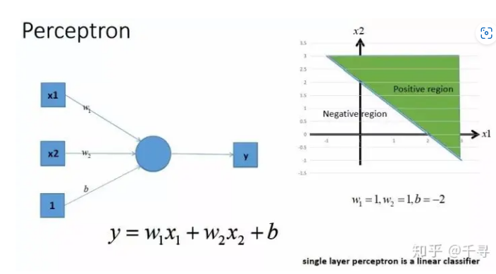

不带激活函数的单层感知机是一个线性分类器，不能解决线性不可分的问题。

---

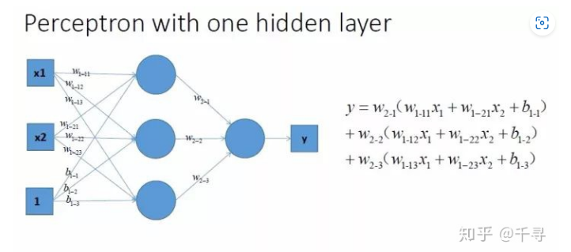

来对y进行一个合并同类项，整理后的公式如下：

$$
y=X1(W_{1-11}W_{2-1}+W_{1-12}W_{2-2}+W_{1-13}W_{2-3}) \\
   +X2(W_{1-21}W_{2-1}+W_{1-22}W_{2-2}+W_{1-23}W_{2-3}) \\
   +W_{2-1}b_{1-1}+W_{2-2}b_{1-2}+W_{2-3}b_{1-3}
$$

合并后的式子，还是一个关于X1和X2的线性表达式，合并后的多个感知器本质上还是一个线性分类器，还是解决不了非线性的问题。

**不管是单层感知机还是多个感知器，只要不带激活函数，都只能解决线性可分的问题**。解决不了我们的线性不可分问题。不信，那我们就在平面中画几条直线试试，结果发现这几条直线无论在平面中如何旋转，都不能完全正确的分开三角形和圆点。结果如图4所示。

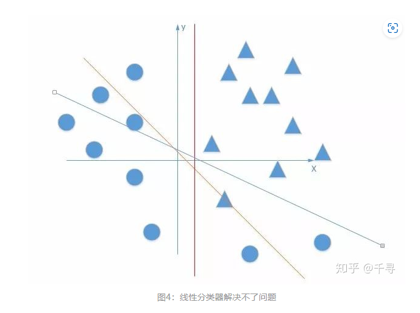

**在上面的线性方程的组合过程中，我们其实类似的在做三条直线的线性组合，**如图5所示。

**虽然可用无数条直线去近似接近一条曲线，但是比着用非线性的激活函数来说，单效果太差**

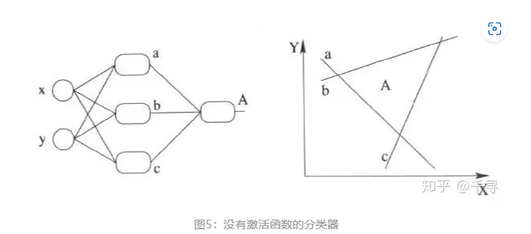

---

在所有的隐层和输出层加一个激活函数，这里激活函数我们就用Sigmoid函数，如图6所示。

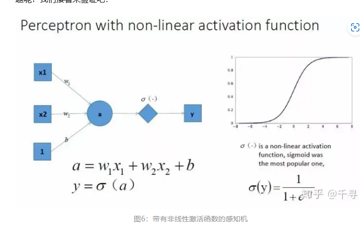

把图6中的带有激活函数的单层感知机扩展到带有激活函数的多个神经元的情况。那么神经网络的表达能力更强，具体如图7所示。

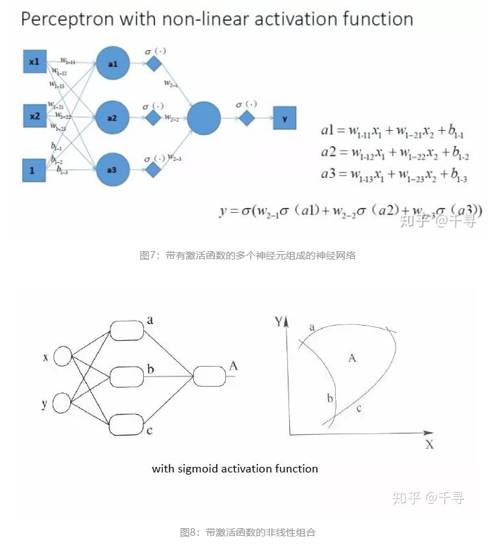

**总结：激活函数是用来加入非线性因素的，提高神经网络对模型的表达能力，解决线性模型所不能解决的问题。**

## 作用总结

> 因为神经网络中每一层的输入输出都是一个线性求和的过程，下一层的输出只是承接了上一层输入函数的线性变换，所以如果没有激活函数，那么无论你构造的神经网络多么复杂，有多少层，最后的输出都是输入的线性组合，纯粹的线性组合并不能够解决更为复杂的问题。
> 
> 而引入激活函数之后，我们会发现常见的激活函数都是非线性的，因此也会给神经元引入非线性元素，使得神经网络可以逼近其他的任何非线性函数，这样可以使得神经网络应用到更多非线性模型中。

---

# 常用激活函数

### core ref:

1. [常见的激活函数（activation function）总结 - 知乎 (zhihu.com)](https://zhuanlan.zhihu.com/p/70810466)

2. [深度学习笔记：如何理解激活函数？（附常用激活函数） - 知乎 (zhihu.com)](https://zhuanlan.zhihu.com/p/364620596)
   
   

激活函数至少应该满足以下几点：

+ 可微性：因为优化方法是基于梯度的，这个性质是必须的
+ 单调性：当激活函数是单调的时候，能够保证单层网络是凸函数
+ 输出值的范围：激活函数的输出值的范围可以有限也可以无限。当输出值是有限的时候，基于梯度的优化方法会更加稳定，因为特征的表示受有限权值的影响更加显著；当输出值是无限的时候，模型的训练会更加高效，不过在这种情况下，一般需要更小的learning rate

### 1.sigmoid

$$
f(x)=\frac{1}{1+e^{-x}}
$$

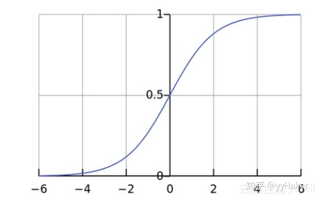

>  sigmoid也具有自身的缺陷。第一点，最明显的就是**饱和性**，从上图也不难看出其两侧导数逐渐趋近于0，

> 因此一旦输入落入两端的饱和区，  导数就会变得接近于0，导致反向传播的梯度也变得非常小，此时网络参数可能甚至得不到更新，难以有效训练，这种现象称为梯度消失。

> 第二点，激活函数的**偏移现象**。sigmoid函数的输出值均大于0，使得输出不是0的均值，这会导致后一层的神经元将得到上一层非0均值的信号作为输入。

### 2 tanh

$$
\tanh (x)=\frac{1-e^{-2 x}}{1+e^{-2 x}}
$$

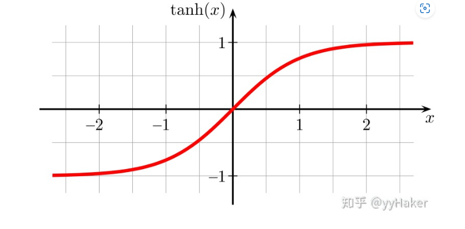

> tanh也是一种非常常见的激活函数，与sigmoid相比，它的输出均值为0，这使得它的收敛速度要比sigmoid快，减少了迭代更新的次数。
> 
> 然而tanh和sigmoid一样具有**饱和性**，会造成梯度消失。

### 3. ReLU（Rectified Linear Units

$$
relu = max(0,x)
$$

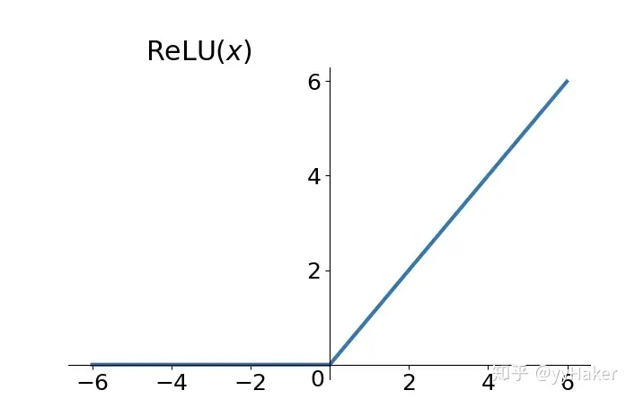

### 4. Leaky-ReLU & P-ReLU

$$
f(x)= \begin{cases}x, & \text { if } x \geq 0 \\ \alpha x, & \text { if } x<0\end{cases}
$$

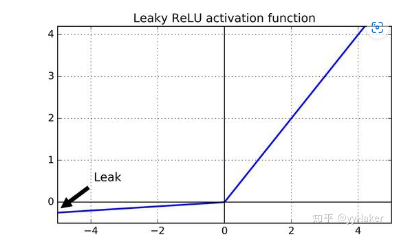

针对 $x<0$ 的硬饱和问题，对 $R e L U$ 作出改进，提出Leaky-ReLU，即在 $x<0$ 部分添加 一个参数 $a$ ，如上图所示。
P-ReLU则认为 $a$ 也应当作为一个参数来学习, 一般建议 $a$ 初始化为 0.25 。

**为什么使用Leaky ReLU会比ReLU效果要好？**

+ Leaky ReLU 通过把 x 的非常小的线性分量给予负输入（0.01x）来调整负值的零梯度（zero gradients）问题，当 x < 0 时，它得到 0.1 的正梯度。该函数一定程度上缓解了 dead ReLU 问题，
+ leak 有助于扩大 ReLU 函数的范围，通常 a 的值为 0.01 左右；
+ Leaky ReLU 的函数范围是（负无穷到正无穷）

尽管Leaky ReLU具备 ReLU 激活函数的所有特征（如计算高效、快速收敛、在正区域内不会饱和），但并不能完全证明在实际操作中Leaky ReLU 总是比 ReLU 更好。

### 5  ELU激活函数

ELU（Exponential Linear Unit） 的提出同样也是针对解决 ReLU负数部分存在的问题，由Djork等人提出,被证实有较高的噪声鲁棒性。ELU激活函数对 x小于零的情况采用类似指数计算的方式进行输出。与 ReLU 相比，ELU 有负值，这会使激活的平均值接近零。均值激活接近于零可以使学习更快，因为它们使梯度更接近自然梯度。 函数表达式为

$$
\mathrm{g}(x)=\mathrm{ELU}(x)=\left\{\begin{array}{r}
x, x>0 \\
\alpha\left(\mathrm{e}^x-1\right), x \leqslant 0
\end{array}\right.
$$

显然，ELU 具有 ReLU 的所有优点，并且：

+ 没有 Dead ReLU 问题，输出的平均值接近 0，以 0 为中心；
+ ELU 通过减少偏置偏移的影响，使正常梯度更接近于单位自然梯度，从而使均值向零加速学习；
+ ELU 在较小的输入下会饱和至负值，从而减少前向传播的变异和信息。

一个小问题是它的**计算强度更高，计算量较大**。与 Leaky ReLU 类似，尽管理论上比 ReLU 要好，但目前在实践中没有充分的证据表明 ELU 总是比 ReLU 好。

### 6   SeLU激活函数

[Self-Normalizing Neural Networks(SNNs)](https://link.zhihu.com/?target=https%3A//arxiv.org/pdf/1706.02515.pdf)论文中SNN基于缩放的指数线性单位“ SELU”，可诱导自标准化属性（例如方差稳定化），从而避免了梯度的爆炸和消失。 SELU函数是给ELU函数乘上系数 $ \lambda $ ，即 $ S E L U(x)=\lambda \cdot E L U(x) $

$$
f(x)=\lambda \begin{cases}\alpha\left(e^x-1\right) & x \leq 0 \\ x & x>0\end{cases}
$$

通过论文中大量的证明，作者给出了 $\lambda$ 和 $\alpha$ 的值:

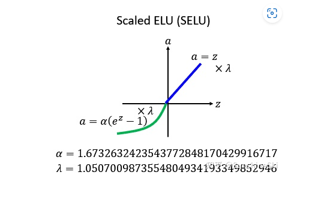

SELU函数的特点是：

+ 它的值有正有负：在整个ReLU的family里里面，除了一开始最原始的ReLU以外都有负值，该函数也贯彻了这个特性；
+ 有Saturation Region：其他的ReLU他们没有Saturation Region，但是他有Saturation Region，不过ELU其实也有Saturation Region，因为SELU就只是ELU乘上一个λ而已;乘上这个λ有什么不同？乘上λ，让它在某些区域的斜率是大于1的，意味着说你进来一个比较小的变化，通过Region以后，他把你的变化放大1.0507700987倍，所以它的input能是会被放大的，而且这是他一个ELU的没有的特色。

### 7 Softmax激活函数

Softmax 是用于多类分类问题的激活函数，在多类分类问题中，超过两个类标签则需要类成员关系。对于长度为 K 的任意实向量，Softmax 可以将其压缩为长度为 K，值在（0，1）范围内，并且向量中元素的总和为 1 的实向量。函数表达式如下：

$$
S_i = \frac{e^i}{\sum{e^j}}
$$

### 8  GeLU

高斯误差线性单元（Gaussian Error Linear Unit）。与其他常用的激活函数（如ReLU和sigmoid）相比，GELU具有更平滑的非线性特征，这有助于提高模型的性能。

$$
\operatorname{GELU}(x)=0.5 x\left(1+\tanh \left(\sqrt{2 / \pi}\left(x+0.044715 x^3\right)\right)\right)
$$

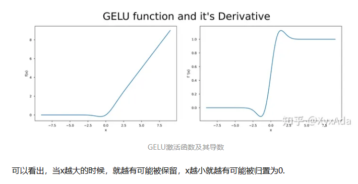

GELU的优点是，它在处理负数时不会像ReLU一样将输入裁剪到0，这可能导致梯度消失的问题。而且，GELU在大多数情况下比sigmoid和tanh表现更好，因为它在处理较大的输入时，会比sigmoid和tanh产生更强的非线性响应，而在处理较小的输入时，又比ReLU表现更好，因为它有一个非零的梯度。

1. 具有更光滑的导数：GELU函数的导数是连续的，这使得在训练深度神经网络时可以更容易地传播梯度，避免了ReLU函数在  处的导数不连续的问题，从而减少了训练过程中出现的梯度消失问题。
2. 可以提高模型的性能：在实际任务中，使用GELU函数的模型通常比使用ReLU函数的模型表现更好，尤其是在自然语言处理和计算机视觉任务中。
3. 可以加速收敛：GELU函数在激活函数的非线性变换中引入了类似于sigmoid函数的变换，这使得GELU函数的输出可以落在一个更广的范围内，有助于加速模型的收敛速度。

### 9 GLU

$$
\mathrm{GLU}(x, W, V, b, c)=\sigma(x W+b) \otimes(x V+c)
$$

GLU（Gated Linear Unit）激活函数是一种用于神经网络的激活函数，它具有门控机制，可以帮助网络更好地捕捉序列数据中的长期依赖关系。

理解GLU激活函数的关键在于它的门控机制。门控机制使得GLU能够选择性地过滤输入向量的某些部分，并根据输入的上下文来调整输出。门控部分的作用是将输入进行二分类，决定哪些部分应该被保留，哪些部分应该被抑制。

在深度学习中，激活函数的物理意义通常不是直接解释的，而是通过其数学性质和在网络中的作用来理解。对于GLU（Gated Linear Unit）激活函数，其物理意义可以从以下几个方面来理解：

1. 门控机制：GLU激活函数具有门控机制，通过Sigmoid函数对输入进行门控操作，决定哪些部分应该被保留、哪些部分应该被抑制。这种门控机制类似于神经元的兴奋和抑制，可以帮助网络有选择地过滤输入信息，以适应不同的上下文和任务需求。
2. 信息筛选：GLU激活函数可以帮助网络选择性地关注输入向量的某些部分，并抑制不相关或噪声信息。门控机制根据输入的上下文和语境，对输入进行二分类，决定信息的重要性和保留程度，从而提高网络的表达能力和泛化能力。
3. 长期依赖关系：GLU激活函数在序列数据和自然语言处理（NLP）任务中具有重要作用，可以帮助网络捕捉长期依赖关系。门控机制可以帮助网络在处理序列数据时，更好地捕捉到序列中的长距离依赖，从而提高模型的性能和效果。

虽然激活函数的物理意义不像一些直观的物理概念那样容易解释，但理解其数学特性和在网络中的作用可以帮助我们理解为什么它在某些任务和网络结构中表现良好，并能够指导我们在设计和调整网络时的选择和优化。

### 10. SwiGLU & GeGLU  (llama SwiGLU)

（ [Gated Linear Units](https://link.zhihu.com/?target=https%3A//arxiv.org/pdf/2002.05202.pdf)）

SwiGLU 和 GeGLU都是Noam Shazeer在文章中探索的激活函数变体

具体的，需要先了解门线性单元（Gated Linear Unit, GLU）这个基本的双线性函数，为

$$
\mathrm{GLU}(x, W, V, b, c)=\sigma(x W+b) \otimes(x V+c)
$$

这里的 $\oplus$ 表示矩阵的逐元素相乘，而SwiGLU和GeGLU则定义为：

$$
\begin{aligned}
\operatorname{GEGLU}(x, W, V, b, c) & =\operatorname{GELU}(x W+b) \otimes(x V+c) \\
\operatorname{SwiGLU}(x, W, V, b, c, \beta) & =\operatorname{Swish}_\beta(x W+b) \otimes(x V+c)
\end{aligned}
$$

这里 $\operatorname{Swish}_\beta(x)=x \sigma(\beta x) ， \beta$ 为指定常数，如1
作者并没有对激活函数提出的原理和动机做过多描述，论文本身是对各类激活函数变种效果的对比 尝试

可以看到SwishGLU和GeGLU是可以取得最小误差的，而在大模型中也得到了广泛应用

