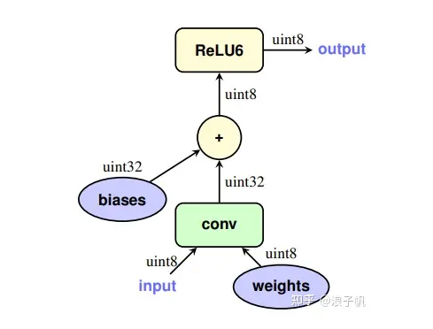
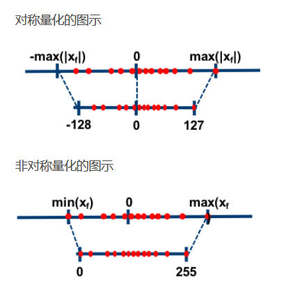
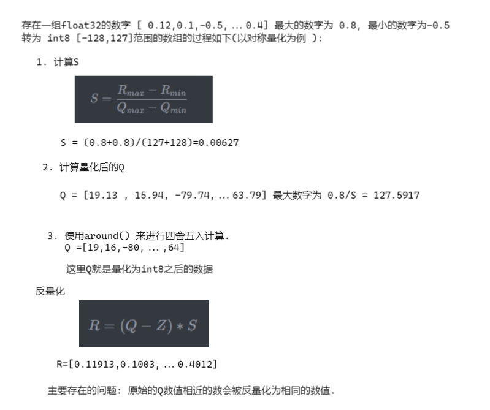
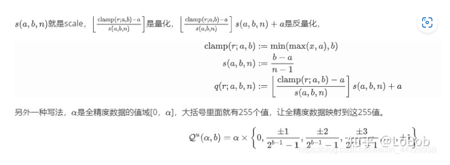
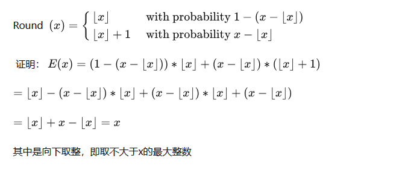
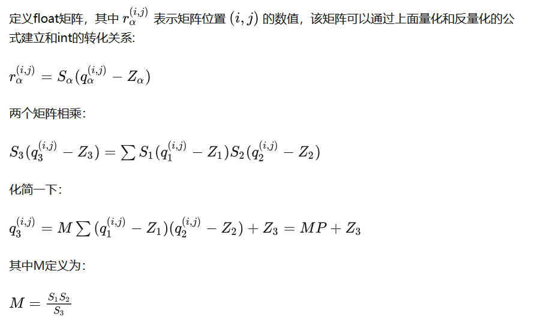

# 模型量化

> ref: [量化 | 浅谈深度学习模型量化 - 知乎 (zhihu.com)](https://zhuanlan.zhihu.com/p/349678095)
> 
> ref: [对称量化 VS 非对称量化 - 知乎 (zhihu.com)](https://zhuanlan.zhihu.com/p/547087460)
> 
> ref: [一个例子看懂CNN量化操作 - 知乎 (zhihu.com)](https://zhuanlan.zhihu.com/p/301226509)

## 量化基础知识

#### 定义及量化目的

量化的主要目标: 通过对数据的映射来缩减数据的存储空间<mark> (<u>如果量化的目标是 8bit,可以理解为对一个black 数据进行归 2^8 化</u>)</mark>

量化是一种对神经网络模型进行压缩和推理加速的方法，这种方法将深度学习模型的权重或激活函数从32位浮点数映射为低比特深度的数据表示

优缺点:

1. 更小的内存等存储空间占用.神经网络模型的大部分参数都是float32，将其映射为int8乃至更少的bit，其一可以有效减少模型的大小，

2. 损失了数值精度

3. 更小的bit（如int8）进行运算时指令吞吐量远高于float32，从而大大提高运算效率，加快模型的推理速度。

量化映射方法，也就是将float-32映射到Int数据类型，每个间隔是相等的还是不相等的，这里就是<mark>均匀量化(uniform quantization)</mark>和<mark>非均匀量化(non-uniform quantization)</mark>，也可以叫作线性量化和非线性量化.

#### 2.非对称量化与对称量化

关于映射到整数是数值范围是有正负数，还是都是正数，这里就是对称量化(有正负数)和非对称量化(全是正数)，非对称量化就有zero-point，zero-point的主要作用是用于平移真个映射后的数据空间 (e.p.  (-128,127)->(0,255) )  。

> 对称量化 ，如果是对称量化，则是将原浮点数的范围由[Xmin, Xmax]扩充为[-Xmax, Xmax]，这里假定 |Xmax|>|Xmin|。正负两个区间长度相等
> 
> > 对称量化对于正负数不均匀分布的情况不够友好，比如如果浮点数全部是正数，量化后的数据范围是[128,255], [0，127]的范围就浪费了，减弱了int8数据的表示范围。

> 非对称量化 : 将数据缩放为 [0, 2*Xmax] 

由高精度量化为低精度的数学表达:

$$
Q = \frac {R} {S} +Z
$$

反量化的数学表达:

$$
R = (Q-Z) * S
$$

其中 R为真实的浮点数(尚未量化的数据) Q为量化后的数据(e.p. int4)  Z 就是zero-point 定点值   S为定点量化后可表示的最小刻度. 

$$
S = \frac {R_{max}-R_{min}}{Q_{max}-Q_{min}}
$$

$R_{max}$ 表示当前区块的最大浮点数, $R_{min}$ 表示最小的浮点数 

$Q_{max} $ 是量化后的最大值,$Q_{min}$ 是量化后的最小值

$Z = Q_{max} - \frac{R_{max}}{S}$

 

##### 别人的例子

## 模型量化

**量化误差到底来自于哪里？**

1、从float-32到Int数据类型，其中有一个round的操作，这里肯定会有误差；  
2、激活函数的截断；  
3、溢出时候的处理也有可能带来误差。

**量化遇到的问题

**

> 2. weight和activation的数据分布呈现出一个类拉普拉斯分布或者类高斯分布，数据分布是一个钟型分布，大部分数据集中在中间，两头的数据比较少。如果采用均与量化(uniform quantization)，由于是等间隔的，那么中间密集分布的数据的分辨率低。举个例子，假如总共10个值，fp32_x={10，-10，0.11，0.21，0.15，0.05，-0.14，-0.22，-0.08，-0.35}，采用对称均匀分布量化，（10-（-10））/（255）= 20/255，Int8_x={127，-127，1，3，2，1，-2，-3， -1，-5}，可以看到，0.05和0.11被量化同一个int-8的数值1，而且量化后的数值大部分集中在了[-5,3]，而其余的数值没有用到。
> 
> 3. 另外一个问题就是每一层的数值范围不一定都相同，activation在不同层的数值范围会不一样，这就会产生另外一个问题，动态值域问题，dynamic range。
> 
> 4. round会肯定会带来误差，怎么处理呢？Stochastic rounding，因为其期望是x，可以减少round的误差.
>    
>    
>    
>    

### **矩阵乘法实现**

### 模型量化的具体使用场景

模型 ==> 量化模型==> 量化模型计算==> 计算结果的反量化

#### e.p.(ref: [一个例子看懂CNN量化操作 - 知乎 (zhihu.com)](https://zhuanlan.zhihu.com/p/301226509))

将float型的数值量化到int8上运算，再反量化回float数值，整个计算过程不涉及float类型的运算。

计算 0.3* 0.5  = 0.15  这是浮点计算

其中可以认为0.3和0.5这两个数是矩阵1和矩阵2中的两个数，float类型的。

int8 的表示范围[-128,127]

假设0.3是矩阵1中一个值，矩阵A最大值为：1.0，最小值为：-1.2。根据公式，求得S1=0.008627451，Z1=11。则0.3转化为46。

假设0.5是矩阵2中一个值，矩阵B最大值为：1.2，最小值为：-1.0。根据公式，求得S2=0.008627451，Z2=-12。则0.5转化为46。

这里我们还需要矩阵3，也就是0.15那个矩阵的最大值和最小值，假设矩阵3最大值为：2，最小值为：-0.8。求得S3=0.010980392，Z3=-55。

因为矩阵3是需要求出的矩阵，是未知的  .如何获取其最大值和最小值呢？再真正量化之前会先执行多次正常的float运算，收集矩阵3的大概范围，获取这个两个值。这个过程就叫校准（或者叫标定）。不是真实的值没有关系，因为校准数据和真实测试数据是同分布，校准的值差异不大，基本不会影响最终的精度。

计算M=S1*S2/S3=0.006778711，

反量化计算的结果为 :  q= 0.142745

两者差值为量化误差
