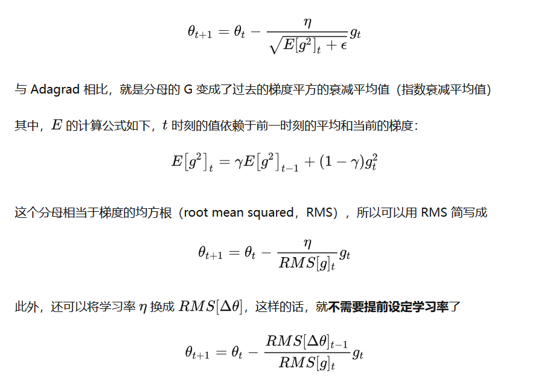

# optimizer

>  main ref: [收藏版｜史上最全机器学习优化器Optimizer汇总 - 知乎 (zhihu.com)](https://zhuanlan.zhihu.com/p/416979875)
> 
> ref: [一个框架看懂优化算法之异同 SGD/AdaGrad/Adam - 知乎 (zhihu.com)](https://zhuanlan.zhihu.com/p/32230623)

优化器就是在深度学习反向传播过程中，指引损失函数（目标函数）的各个参数往正确的方向更新合适的大小，使得更新后的各个参数让损失函数（目标函数）值不断逼近全局最小。

### 

## 参数定义:

$$
首先定义：\\
待优化参数： w \\
目标函数： f(w)  \\
初始学习率 \alpha \\
在每个epoch \quad  t\\

\\

1.计算目标函数关于当前参数的梯度： g_t= \nabla f(w_t)
\\

根据历史梯度计算一阶动量和二阶动量：m_t = \phi(g_1,g_2,...g_t) \quad V_t = \varphi(g_1,g_2,...g_t) \\

计算当前时刻的下降梯度： \eta_t = f(g_t, m_t,V_t) \\

根据下降梯度进行更新： W_{t+1}  = W_t -\eta_t

$$

一般来讲 一阶动量操作的是 过去一段时间的类似于平均值的数, 体现的是过去一段时间内模型的梯度更新方向

                 二阶动量操作的是过去一段时间梯度的平方, 使用的使用要再进行开根号,是更高阶的数据平滑操作

## 仅关注梯度的optimizer

### 梯度下降法 (Gradient Descent)

标准的梯度下降主要有两个缺点：

> **训练速度慢**：每走一步都要计算调整下一步的方向，下山的速度变慢。在应用于大型数据集中，每输入一个样本都要更新一次参数，且每次迭代都要遍历所有的样本。会使得训练过程及其缓慢，需要花费很长时间才能得到收敛解。
> 
> **容易陷入局部最优解**：落入鞍点，梯度为0，使得模型参数不在继续更新。

因此，真正在使用时，主要是经过改进的以下三类方法，区别在于**每次参数更新时计算的样本数据量不同**：

+ 批量梯度下降法(BGD, Batch Gradient Descent)
+ 随机梯度下降法(SGD, Stochastic Gradient Descent)
+ 小批量梯度下降法(Mini-batch Gradient Descent)

### **批量梯度下降法 (Batch Gradient Descent, BGD)**

**这里的“批量”其实指的就是整个训练集的数据**

BGD相对于标准GD进行了改进，所谓“批量”，也就是不再像标准GD一样，对每个样本输入都进行参数更新，而是针对**所有的数据**输入进行参数更新。

> **优点**：由于**每一步迭代使用了全部样本**，每次下降的方向为总体的平均梯度，因此损失函数收敛过程会比较稳定。对于凸函数可以收敛到全局最小值，对于非凸函数可以收敛到局部最小值。
> 
> **缺点**：每一步更新中，都要利用全部样本计算梯度，计算起来非常慢，遇到很大量的数据集也会非常棘手，而且不能投入新数据实时更新模型。

### **随机梯度下降（Stochastic Gradient Descent, SGD）**

随机梯度下降法，不像BGD每一次参数更新，需要计算整个数据样本集的梯度，而是每次参数更新时，仅仅选取一个样本 $(x_i,y_i)$ 计算其梯度，参数更新公式为

公式看起来和上面标准GD一样，但不同点在于，这里的样本是从所有样本中随机选取一个，而标准GD是所有的样本都输入进行计算。

可以看到BGD和SGD是两个极端，SGD由于每次参数更新仅仅需要计算一个样本的梯度，训练速度很快，即使在样本量很大的情况下，可能只需要其中一部分样本就能迭代到最优解，由于每次迭代并不是都向着整体最优化方向，导致梯度下降的波动非常大（如下图），更容易从一个局部最优跳到另一个局部最优，准确度下降。

> **优点**：
> 
> + 由于每次迭代只使用了一个样本计算梯度，训练速度快，包含一定随机性，但是从期望来看，每次计算的梯度基本是正确的导数的。虽然看起来SGD波动非常大，会走很多弯路，但是对梯度的要求很低（计算梯度快），而且对于引入噪声，大量的理论和实践工作证明，只要噪声不是特别大，SGD都能很好地收敛。
> + 应用大型数据集时，训练速度很快。比如每次从百万数据样本中，取几百个数据点，算一个SGD梯度，更新一下模型参数。相比于标准梯度下降法的遍历全部样本，每输入一个样本更新一次参数，要快得多
> 
> **缺点**：
> 
> + 更新频繁，带有随机性，会造成损失函数在收敛过程中严重震荡。SGD没能单独克服局部最优解的问题（主要）
> + SGD在随机选择梯度的同时会引入噪声，使得权值更新的方向不一定正确（次要）

### **小批量梯度下降法（Mini-batch Gradient Descent, MBGD or SGD）**

小批量梯度下降法就是结合BGD和SGD的折中，对于含有  个训练样本的数据集，每次参数更新，

**优点**：

可以降低参数更新时的方差，收敛更稳定，另一方面可以充分地利用深度学习库中高度优化的矩阵操作来进行更有效的梯度计算

缺点：

+ Mini-batch gradient descent 不能保证很好的收敛性，learning rate 如果选择的太小，收敛速度会很慢，如果太大，loss function 就会在极小值处不停地震荡甚至偏离（有一种措施是先设定大一点的学习率，当两次迭代之间的变化低于某个阈值后，就减小 learning rate，不过这个阈值的设定需要提前写好，这样的话就不能够适应数据集的特点）。对于非凸函数，还要避免陷于局部极小值处，或者鞍点处，因为鞍点所有维度的梯度都接近于0，SGD 很容易被困在这里（会在鞍点或者局部最小点震荡跳动，因为在此点处，如果是BGD的训练集全集带入，则优化会停止不动，如果是mini-batch或者SGD，每次找到的梯度都是不同的，就会发生震荡，来回跳动）。
+ SGD对所有参数更新时应用同样的 learning rate，如果我们的数据是稀疏的，我们更希望对出现频率低的特征进行大一点的更新， 且learning rate会随着更新的次数逐渐变小。

## 加入动量的优化方法

### **动量优化法（Momentum）**

momentum算法思想：参数更新时在一定程度上保留之前更新的方向，同时又利用当前batch的梯度微调最终的更新方向，简言之就是通过积累之前的动量来 (previous_sum_of_gradient) 加速当前的梯度。SGD只使用了当步参数的梯度，随机性较大。如果将历次迭代的梯度按比例融合，可能更加稳定、更有利于跳出局部最优。

一阶动量  $m_t$是各个时刻梯度方向的指数移动平均值，约等于最近  $\frac{1}{1-\gamma}$个时刻的梯度向量和的平均值。也就是说， t时刻的下降方向，不仅由当前点的梯度方向决定，而且由此前累积的下降方向决定。

> 动量主要解决SGD的两个问题：
> 
> + 随机梯度的方法（引入的噪声）
> + Hessian矩阵病态问题（可以理解为SGD在收敛过程中和正确梯度相比来回摆动比较大的问题）
> 
> **优点**：
> 
> 前后梯度一致的时候能够加速学习；前后梯度不一致的时候能够抑制震荡，越过局部极小值（加速收敛，减小震荡）
> 
> **缺点**：
> 
> 增加了一个超参数

### **NAG（Nesterov accelerated gradient）**

## 自适应学习率优化算法

传统的优化算法要么将学习率设置为常数要么根据训练次数调节学习率。往往忽视了学习率其他变化的可能性。

> + 对于某些参数，通过算法已经优化到了极小值附近，但是有的参数仍然有着很大的梯度。
> + 如果学习率太小，则梯度很大的参数会有一个很慢的收敛速度； 如果学习率太大，则已经优化得差不多的参数可能会出现不稳定的情况。 解决方案：
> + 对每个参与训练的参数设置不同的学习率，在整个学习过程中通过一些算法自动适应这些参数的学习率。 如果损失与某一指定参数的偏导的符号相同，那么学习率应该增加； 如果损失与该参数的偏导的符号不同，那么学习率应该减小。
> 
> 自适应学习率算法主要有：AdaGrad算法，RMSProp算法，Adam算法以及AdaDelta算法等

### **AdaGrad（(Adaptive Gradient)）**

Adagrad其实是对学习率进行了一个约束，对于经常更新的参数，我们已经积累了大量关于它的知识，不希望被单个样本影响太大，希望学习速率慢一些；对于偶尔更新的参数，我们了解的信息太少，希望能从每个偶然出现的样本（稀疏特征的样本）身上多学一些，即学习速率大一些。

AdaGrad 算法，独立地适应所有模型参数的学习率，缩放每个参数反比于其**所有梯度历史平均值总和的平方根**。

+ 具有损失函数最大梯度的参数相应地有个快速下降的学习率
+ 而具有小梯度的参数在学习率上有相对较小的下降。

> **优点**：
> 
> 自适应的学习率，无需人工调节
> 
> **缺点**：
> 
> + 仍需要手工设置一个全局学习率 , 如果  设置过大的话，会使 regularizer 过于敏感，对梯度的调节太大
> + 中后期，**分母上梯度累加的平方和会越来越大，使得参数更新量趋近于0**，使得训练提前结束，无法学习

### **Adadelta**

由于AdaGrad调整学习率变化过于激进，我们考虑一个改变二阶动量计算方法的策略：不累积全部历史梯度，而只关注过去一段时间窗口的下降梯度，即Adadelta只累加固定大小的项，并且也不直接存储这些项，仅仅是近似计算对应的平均值（指数移动平均值），这就避免了二阶动量持续累积、导致训练过程提前结束的问题了，参数更新公式如下

> **优点**：
> 
> + 不依赖全局learning rate
> + 训练初中期，加速效果不错，很快
> 
> **缺点**： 训练后期，反复在局部最小值附近抖动

### **RMSprop**

RMSprop 和 Adadelta 都是为了解决 Adagrad 学习率急剧下降问题的，但是RMSProp算法修改了AdaGrad的梯度平方和累加为**指数加权的移动平均**，使得其在非凸设定下效果更好。

指数加权平均，旨在消除梯度下降中的摆动，与Momentum的效果一样，某一维度的导数比较大，则指数加权平均就大，某一维度的导数比较小，则其指数加权平均就小，这样就保证了各维度导数都在一个量级，进而减少了摆动。

另外，**指数衰减平均的方式可以淡化遥远过去的历史对当前步骤参数更新量的影响**，衰减率表明的是只是最近的梯度平方有意义，而很久以前的梯度基本上会被遗忘

> **优点**：
> 
> + RMSprop算是Adagrad的一种发展，和Adadelta的变体，效果趋于二者之间
> + 适合处理非平稳目标(包括季节性和周期性)——对于RNN效果很好
> 
> **缺点**：
> 
> + 其实RMSprop依然依赖于全局学习率

### **Adam（Adaptive Moment Estimation）**

Adam 结合了前面方法的一阶动量和二阶动量，相当于 Ada + Momentum，SGD-M和NAG在SGD基础上增加了一阶动量，AdaGrad和AdaDelta在SGD基础上增加了二阶动量。

Adam 除了像 Adadelta 和 RMSprop 一样存储了过去梯度的平方 v_t 的指数衰减平均值 ，也像 momentum 一样保持了过去梯度 m_t 的指数衰减平均值：

> **优点**：
> 
> + Adam梯度经过偏置校正后，每一次迭代学习率都有一个固定范围，使得参数比较平稳。
> + 结合了Adagrad善于处理稀疏梯度和RMSprop善于处理非平稳目标的优点
> + 为不同的参数计算不同的自适应学习率
> + 也适用于大多非凸优化问题——适用于大数据集和高维空间。
> 
> **缺点**： Adam 使用动量的滑动平均，可能会随着训练数据变化而抖动比较剧烈，在online场景可能波动较大，在广告场景往往效果不如 AdaGrad

### **Nadam**

其实如果说要集成所有方法的优点于一身的话，Nadam应该就是了，Adam遗漏了啥？没错，就是Nesterov项，我们在Adam的基础上，加上Nesterov项就是Nadam了，参数更新公式如下：

### **AdamW**

Adam有很多的优点，但是在很多数据集上的最好效果还是用SGD with Momentum细调出来的。可见Adam的泛化性并不如SGD with Momentum。[Decoupled Weight Decay Regularization](https://link.zhihu.com/?target=https%3A//arxiv.org/pdf/1711.05101.pdf) 提出其中一个重要原因就是 Adam中L2正则化项并不像在SGD中那么有效

+ L2正则和Weight Decay在Adam这种自适应学习率算法中并不等价，只有在标准SGD的情况下，可以将L2正则和Weight Decay看做一样。特别是，当与自适应梯度相结合时，L2正则化导致具有较大历史参数和/或梯度幅度的权重比使用权重衰减时更小。  

+ 使用Adam优化带L2正则的损失并不有效，如果引入L2正则化项，在计算梯度的时候会加上正则项求梯度的结果。正常的权重衰减是对所有的权重都采用相同的系数进行更新，本身比较大的一些权重对应的梯度也会比较大，惩罚也越大。但由于Adam计算步骤中减去项会有除以梯度平方的累积，使得梯度大的减去项偏小，从而具有大梯度的权重不会像解耦权重衰减那样得到正则化。 这导致自适应梯度算法的L2和解耦权重衰减正则化的不等价。  

而在常见的深度学习库中只提供了L2正则，并没有提供权重衰减的实现。这可能就是导致Adam跑出来的很多效果相对SGD with Momentum有偏差的一个原因

AdamW 使用了严谨的 weight decay（非L2正则），即权重衰减不参与一、二动量计算，只在最后的更新公式中使用。其更新公式如下：

