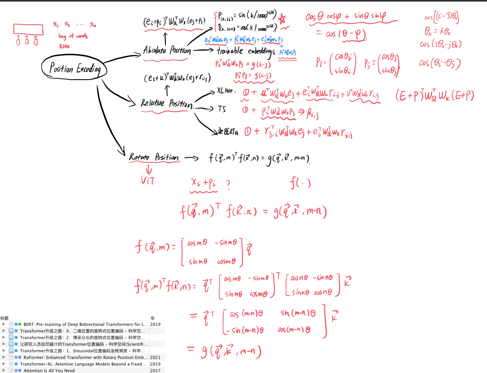
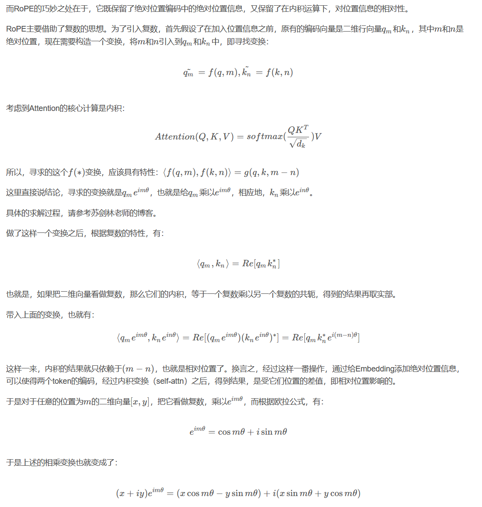
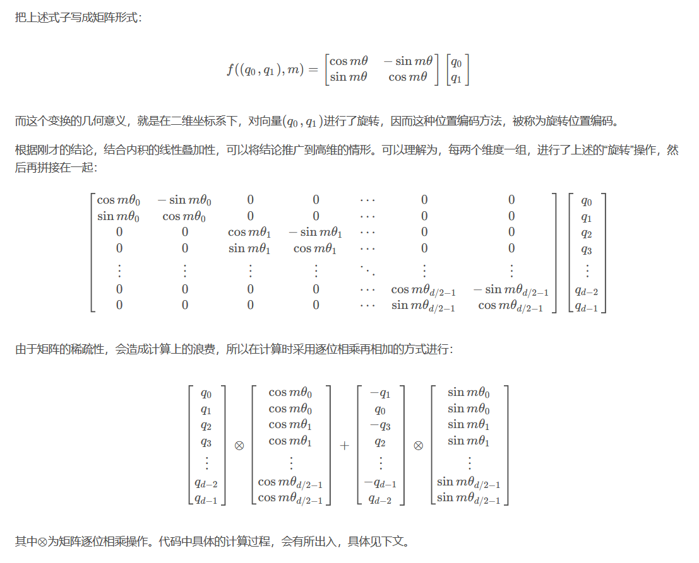

# 位置编码

## ref:  https://www.bilibili.com/video/BV1rK4y1X7xd/

ref: [Meta最新模型LLaMA细节与代码详解_常鸿宇的博客-CSDN博客](https://blog.csdn.net/weixin_44826203/article/details/129255185)

RoPE（Rotary Position Embedding）旋转位置编码，是苏剑林老师提出的一种旋转位置编码方法，其思想是采用绝对位置编码的形式，实现相对位置编码。

而RoPE的巧妙之处在于，它既保留了绝对位置编码中的绝对位置信息，又保留了在内积运算下，对位置信息的相对性。

## 旋转矩阵特点

$$
二维旋转矩阵 : \\

\left[\begin{array}{l}
x^{\prime} \\
y^{\prime}
\end{array}\right]=\left[\begin{array}{rr}
\cos \beta & -\sin \beta \\
\sin \beta & \cos \beta
\end{array}\right] \cdot\left[\begin{array}{l}
x \\
y
\end{array}\right]
$$

旋转矩阵的特点: $A^TA =E$ 即 $A^T = A^{-1}$

$$
A_1A_2\alpha  其中A为旋转矩阵,表示对\alpha进行两次旋转 先旋转A_2 再旋转A_1 \\
A_1^TA_2\alpha ==  A_1^{-1}A_2\alpha  表示 先旋转A_2 再旋转A_1^{-1} 也就是在逆旋转一个A_1 \\
因此: 一个旋转矩阵的转置与另一个旋转矩阵的点乘 = 两个旋转矩阵的夹角的差. 
$$

$$
\begin{array}{l}
f(\vec{q}, m)^{\top} f(\vec{k}, n)=\vec{q}^{\top}\left[\begin{array}{cc}
\cos m \theta & -\sin m \theta \\
\sin m \theta & \cos m \theta
\end{array}\right]^{\top}\left[\begin{array}{cc}
\cos n \theta & -\sin n \theta \\
\sin n \theta & \cos n \theta
\end{array}\right] \vec{k} \\
=\vec{q}^{\top}\left[\begin{array}{cc}
\cos (m-n) \theta & \sin (m-n) \theta \\
-\sin (m-n) \theta & \cos (m-n) \theta
\end{array}\right] \vec{k} \\
=g(\vec{q}, \vec{k}, m-n) \\
\end{array}
$$
